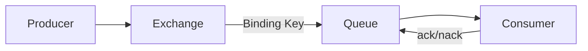

# RabbitMQ 基础与工作模式

## 定义

RabbitMQ 是基于 AMQP 的消息队列，核心对象包括 Exchange、Queue、Binding、Producer 和 Consumer。

## 工作模式

- 简单队列。
- 工作队列。
- 发布订阅。
- 路由模式。
- Topic 模式。

## 相关概念

- [[消息队列总览：RabbitMQ、Kafka 与可靠消息]]
- [[消息可靠性：确认、重试与死信队列]]

## 消息流转

## 模式选择

- 工作队列：多个消费者竞争处理任务，适合异步任务分发。
- 发布订阅：一条消息广播到多个队列，适合多业务方同时接收事件。
- 路由模式：根据 routing key 精确路由，适合日志级别、业务类型分流。
- Topic 模式：按通配符匹配路由，适合多维主题订阅。

## 实践检查清单

- 是否开启生产者确认，避免消息未到 Broker 却被当作成功。
- 消费者是否手动 ack，并在失败时进入重试或死信队列。
- 队列、Exchange、Binding 是否由基础设施代码管理，避免手工漂移。
- 消息体是否包含唯一 ID、事件类型、版本和发生时间。
- 消费逻辑是否幂等，能处理重复投递。

## 设计边界

RabbitMQ 更适合可靠任务分发、业务事件通知和复杂路由，不应被当作数据库或无限缓存使用。消息一旦进入异步链路，调用方就不能再假设下游已经立即完成，因此业务状态要能表达“处理中”“已完成”“失败待重试”等中间态。

设计消息时要区分事件和命令。事件描述已经发生的事实，命令要求某个消费者执行动作。两者混用会让下游语义不清，也会增加重复消费和补偿处理的难度。

## 常见误区

- 以为消息队列天然保证“只消费一次”。
- 重试没有上限，故障消息反复阻塞正常消息。
- 业务事件和命令消息混用，导致下游难以理解语义。
