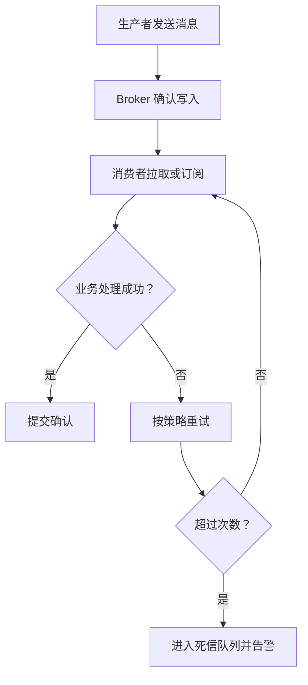

# 消息可靠性：确认、重试与死信队列

## 定义

消息可靠性是确保消息从生产、投递到消费过程中尽量不丢失、可重试、可追踪和可补偿的机制集合。

## 要点

- Producer 确认保证消息进入队列或日志。
- Consumer 确认保证处理成功后再提交进度。
- 重试要有次数、退避和死信队列。
- 死信消息需要告警和人工处理入口。

## 处理流程

## 实践检查清单

- 生产者是否启用发送确认或事务消息。
- 消费者是否在业务成功后再确认。
- 重试是否有次数、退避和幂等保护。
- 死信队列是否有告警、查询和补偿入口。
- 是否能通过 traceId 或消息 ID 追踪全链路。

## 案例

订单创建消息发送失败时，生产者应能感知并重试；库存扣减失败时，消费者不应直接确认消息，而是进入重试或死信流程。最终必须能定位失败订单并人工补偿。

## 常见误区

- 只保证生产者发送成功，却不关注消费者处理结果。
- 重试没有退避策略，故障时把下游打垮。
- 死信队列无人处理，最终变成问题垃圾桶。
- 没有幂等保护，重试导致重复扣款或重复发券。

## 复盘提示

可靠消息的目标不是永不失败，而是失败可发现、可追踪、可重试、可补偿。设计时要把异常路径当成主路径的一部分。

## 相关概念

- [[消息队列总览：RabbitMQ、Kafka 与可靠消息]]
- [[重试]]
- [[消息幂等与顺序消费]]
