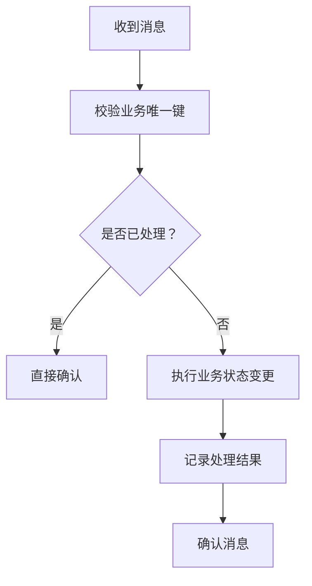

# 消息幂等与顺序消费

## 定义

消息幂等与顺序消费是消息队列落地中的两类关键问题：重复消息不能造成重复业务结果，同一业务实体的事件需要按业务要求的顺序处理。

## 实践要点

- 用消息 ID、业务唯一键或状态机保证消费幂等。
- 同一订单、用户或聚合根的消息尽量进入同一分区或队列。
- 消费失败要有重试、死信队列和人工补偿入口。
- 顺序要求越强，吞吐和并行度通常越受限制。

## 处理流程

## 案例

订单支付成功消息可能被重复投递。消费者应以订单号或支付流水号做幂等键，先判断订单是否已经从“待支付”变为“已支付”，若已经处理则直接确认消息，避免重复加积分、重复发券或重复通知。

## 检查清单

- 消息是否有全局唯一 ID 或业务唯一键。
- 消费端是否能安全重复执行。
- 顺序要求是全局顺序还是单个业务实体顺序。
- 重试和死信是否会破坏顺序。
- 补偿任务是否能定位失败消息和业务状态。

## 常见误区

- 只依赖消息队列“不重复投递”的理想假设，没有消费端幂等。
- 把全局顺序当成默认要求，导致吞吐量被无谓压低。
- 重试时不记录业务状态，重复失败后无法人工补偿。
- 顺序消费和并发消费混用，未说明同一业务键如何路由。

复盘时要把“消息状态”和“业务状态”分开看，避免只确认消息却没有确认业务结果。

## 相关概念

- [[幂等性]]
- [[消息队列总览：RabbitMQ、Kafka 与可靠消息]]
- [[Transactional Outbox]]
