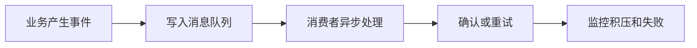

# 消息队列
消息队列用于异步解耦、削峰填谷、事件驱动和可靠任务处理。

## 相关概念
- [[消息队列总览：RabbitMQ、Kafka 与可靠消息]]
- [[Kafka 核心概念与 Consumer Group]]
- [[RabbitMQ 基础与工作模式]]

## 使用流程

## 实践检查清单

- 是否明确消息是事件、命令还是任务。
- 生产者是否有发送确认和失败处理。
- 消费者是否幂等，能承受重复投递。
- 是否设计重试、死信队列和人工补偿。
- 是否监控积压量、消费延迟和失败率。

## 案例

下单成功后发送“订单已创建”事件，库存、积分和通知服务分别消费。订单服务不直接同步调用所有下游，可以降低主链路延迟，但每个消费者必须能处理重复消息。

## 使用边界

消息队列适合削峰、解耦和异步处理，但会引入最终一致性、重复消息、顺序问题和排查复杂度。若调用方必须立刻知道结果，或者业务强依赖同步事务，消息队列不一定是首选方案。

引入队列前要定义业务状态机。用户看到的是“已提交、处理中、成功、失败可重试”，还是只看到最终结果，会影响接口设计、前端提示和补偿流程。

消息队列还需要观测指标，包括生产速率、消费速率、积压量、失败率和死信数量。没有这些指标，异步链路出问题时往往比同步调用更难定位。

## 常见误区

- 以为引入消息队列就自动可靠。
- 消息体没有版本和唯一 ID，后续演进困难。
- 用消息队列掩盖服务边界混乱，导致排查链路更复杂。

## 复盘问题

- 消息是事件、命令还是任务，消费者是否按这个语义处理。
- 重复投递、乱序和死信是否都有明确处理路径。
