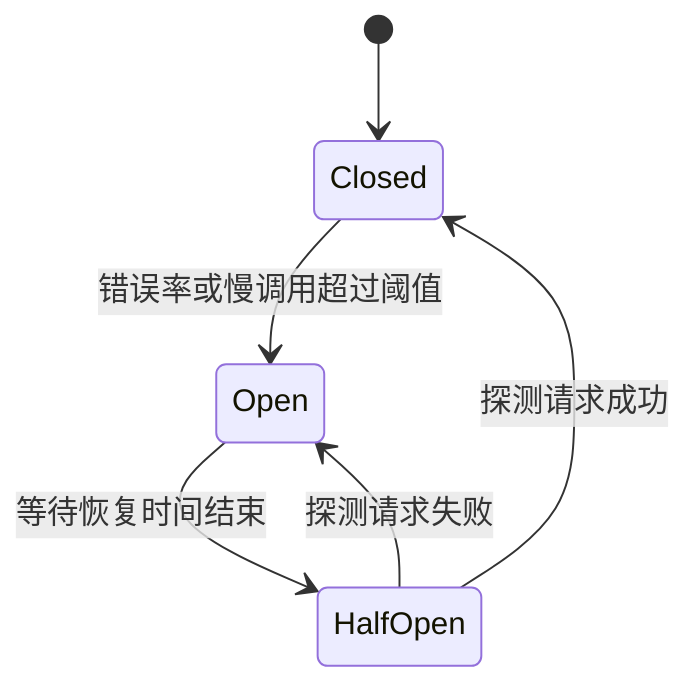

# 熔断器

## 定义

熔断器是一种保护服务调用链的容错机制。当下游服务失败率过高、响应过慢或持续不可用时，熔断器打开，让后续请求快速失败或走降级逻辑，避免调用方和下游被持续拖垮。

## 解决的问题

- 下游故障时，上游持续等待和重试，导致线程、连接池等资源被耗尽。
- 单个服务异常沿调用链扩散，形成级联故障。
- 系统需要在下游恢复前快速失败，并在恢复后逐步探测。

## 要点

- Closed：正常放行请求并统计成功失败。
- Open：快速拒绝请求，不再继续打到下游。
- Half-Open：尝试放行少量请求，用于判断下游是否恢复。
- 常与[[降级]]、[[重试]]、[[超时控制]]一起使用。
- 熔断阈值需要结合错误率、慢调用比例、窗口大小和恢复时间设置。
- 熔断器保护的是调用链稳定性，不是修复下游故障本身。

## 示例

供应商报价接口持续失败后，熔断器打开，商品报价接口直接返回 `CIRCUIT_OPEN` 的降级结果。

对应模块：[[SpringBoot/29-SpringBoot-弹性治理重试超时熔断限流]]。

## 状态转换

## 易错点

- 没有设置[[超时控制]]，请求一直卡住，熔断统计也无法及时触发。
- 熔断后没有可接受的[[降级]]结果，用户体验仍然不可控。
- 对非幂等写操作盲目重试，造成重复副作用。

## 相关概念

- [[降级]]
- [[重试]]
- [[超时控制]]
- [[限流]]
- [[BFF]]
- [[灰度发布]]
