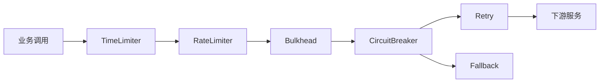

# Resilience4j

## 定义

Resilience4j 是 Java 生态的轻量级容错库，提供熔断、限流、重试、隔离、超时和降级装饰器，用于提升服务间调用的稳定性。

## 能力

- CircuitBreaker：熔断异常或慢调用过多的依赖。
- Retry：对临时失败执行受控重试。
- RateLimiter：限制调用速率。
- TimeLimiter：控制异步调用最长等待时间。
- Bulkhead：限制并发，隔离资源。

## 调用治理流程

实际组合顺序要按业务调整。核心原则是先限制等待和并发，再处理失败、重试和降级，避免把下游故障放大。

## 案例

调用第三方报价接口：

- `TimeLimiter`：最多等待 300ms。
- `CircuitBreaker`：慢调用和失败率过高时打开熔断。
- `Retry`：只对网络抖动重试 1 到 2 次。
- `Fallback`：返回缓存报价或“暂不可用”。

## 检查清单

- 是否区分超时、重试、熔断、限流和隔离的职责。
- 重试是否只用于幂等且短暂失败的调用。
- 熔断阈值是否基于错误率和慢调用率。
- fallback 是否明确标记降级原因。
- 指标是否进入 [[可观测性总览：日志、指标与链路追踪]]。

## 相关概念

- [[熔断器]]
- [[重试]]
- [[限流]]
- [[超时控制]]
