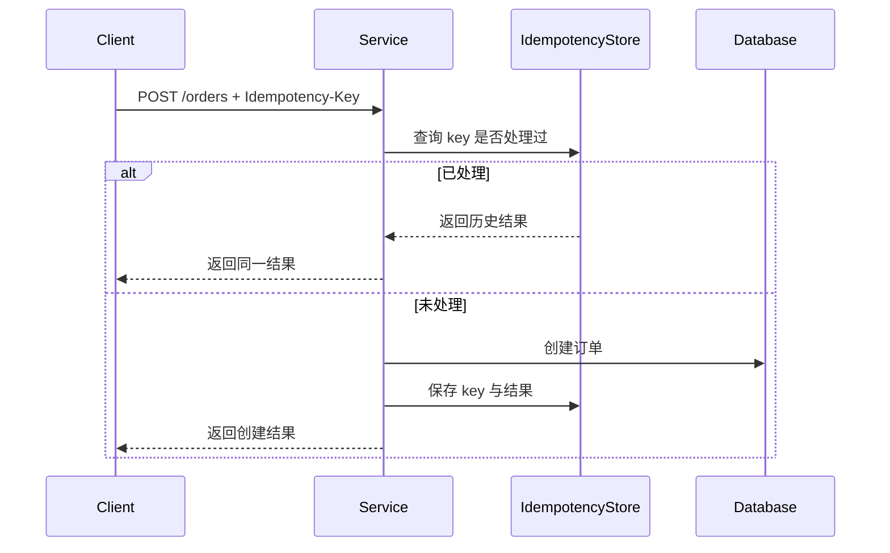

# 幂等性

## 定义

幂等性是指同一个操作执行一次和执行多次产生的业务结果一致。后端系统中，幂等性用于应对网络重试、消息重复投递、用户重复点击和服务超时后的不确定状态。

## 常见方案

- 客户端或服务端生成幂等键，服务端记录请求处理结果。
- 使用唯一约束防止重复创建。
- 对状态流转做前置校验，避免已完成订单再次扣款。
- 消费消息时记录消息 ID 或业务唯一键。

## 典型流程

## 案例

用户点击“提交订单”后网络超时，前端不确定订单是否创建成功，于是自动重试。没有幂等性时，后端可能创建两笔订单；有幂等键时，两次请求共享同一个业务结果。

实践设计：

- 前端生成 `Idempotency-Key`，同一次提交保持不变。
- 后端用唯一索引保存 `userId + key`。
- 首次处理成功后记录响应摘要。
- 后续重复请求直接返回首次结果。
- 如果首次处理失败，要区分“可重试失败”和“确定失败”。

## 判断是否需要幂等

- 是否会自动 [[重试]]。
- 是否可能收到重复消息。
- 是否涉及资金、库存、积分、权益。
- 是否存在用户重复点击或客户端超时。
- 是否跨服务调用，调用方无法确认下游是否成功。

## 适用场景

- 支付、下单、发券、库存扣减。
- 消息消费、任务调度、回调通知。
- 接口超时后的自动 [[重试]]。

## 常见误区

- 只在前端禁用按钮，不在后端兜底。
- 只判断“请求参数一样”，没有唯一业务键。
- 幂等记录没有过期策略，导致存储无限增长。
- 对所有接口都做复杂幂等，增加不必要成本。

## 相关概念

- [[SpringBoot/18-SpringBoot-接口幂等性]]
- [[Transactional Outbox]]
- [[消息幂等与顺序消费]]
- [[最终一致性]]
