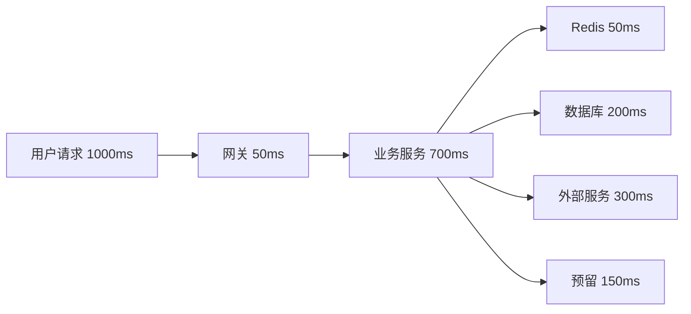
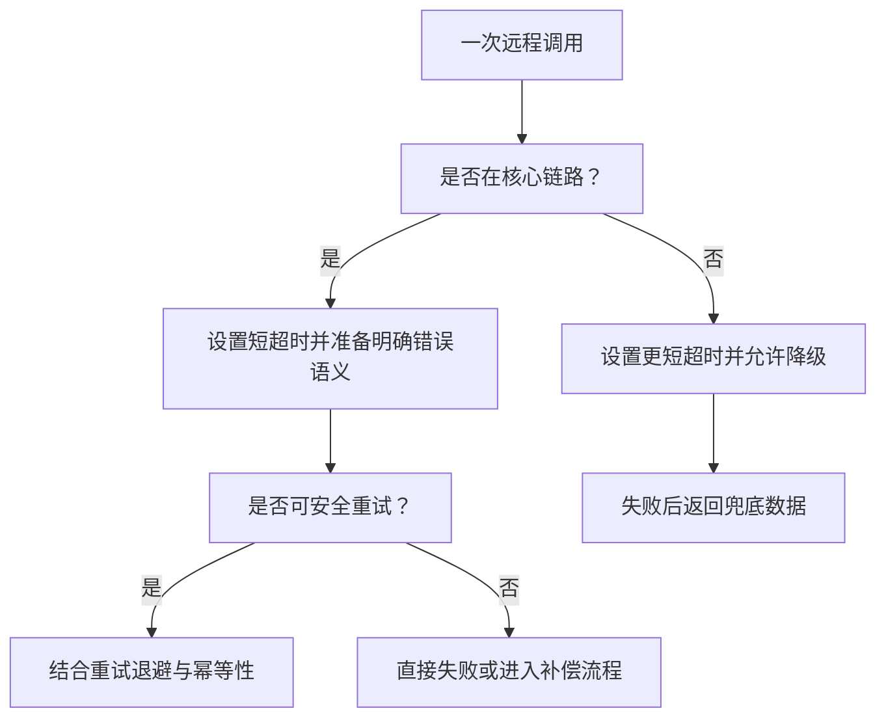

# 超时控制

## 定义

超时控制是为远程调用、数据库查询、缓存访问、消息处理和任务执行设置最大等待时间的稳定性机制。它的目标是避免调用方无限等待，把局部慢故障扩散成线程池耗尽或级联故障。

## 要点

- 所有跨进程调用都应有明确超时，包括 HTTP、RPC、数据库、Redis 和消息队列。
- 超时时间要小于上游请求预算，避免下游耗尽整个链路时间。
- 超时后要结合 [[重试]]、[[降级]]、[[熔断器]] 和错误语义一起设计。
- 短超时不等于可靠，过短会制造大量误失败。

## 实践清单

- 区分连接超时、读超时、写超时和整体请求超时。
- 为核心链路建立超时预算。
- 监控超时率、P95/P99 延迟和线程池等待队列。

## 超时预算设计

超时预算要从上游 SLA 往下拆，而不是每个下游都随意设置 3 秒。若用户请求总预算是 1000ms，下游调用的超时总和不能无限叠加，否则一次慢调用就会占满整个请求链路。

## 决策流程

超时只负责“停止等待”，不负责“业务恢复”。是否 [[重试]]、[[降级]] 或进入补偿，需要结合调用是否幂等、用户是否必须同步拿到结果、下游失败是否会导致数据不一致来判断。

## 案例

商品详情页需要聚合商品、库存、促销和评论：

- 商品主数据：核心信息，超时 300ms，失败则页面不可用。
- 库存：影响购买按钮，超时 150ms，失败时按钮置灰并提示稍后重试。
- 促销：非核心信息，超时 120ms，失败时隐藏优惠区。
- 评论摘要：非核心信息，超时 100ms，失败时展示空摘要。

这类场景常和 [[BFF]] 一起设计。BFF 不能无限等待所有下游，应该按 section 设置超时和局部降级策略。

## 参数建议

- 连接超时通常短于读超时，因为连接建立失败往往说明网络或目标不可达。
- 同步接口的下游超时应明显小于上游网关超时，给错误处理、日志和响应保留时间。
- 批处理任务可以使用更长超时，但要有任务级最大执行时间和中断机制。
- 超时参数必须可配置，不能散落在代码常量里。

## 常见误区

- 只设置客户端超时，服务端线程仍继续执行昂贵任务。
- 所有接口统一一个超时时间，忽略核心链路和非核心链路差异。
- 超时后立刻无脑重试，放大下游压力。
- 只看平均延迟，不监控 P95/P99 和线程池队列。

## 相关概念

- [[重试]]
- [[降级]]
- [[熔断器]]
- [[BFF]]
- [[幂等性]]
- [[SpringBoot/29-SpringBoot-弹性治理重试超时熔断限流]]
