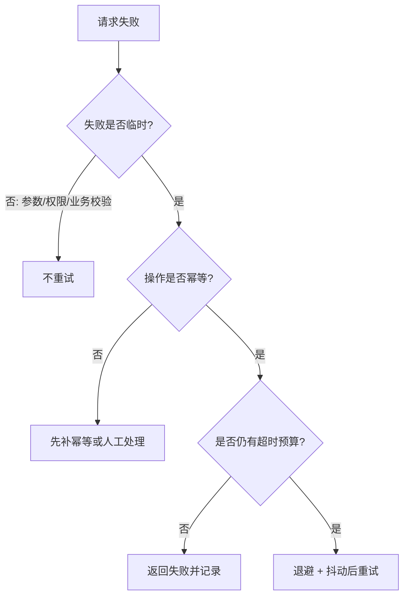

# 重试

## 定义

重试是在操作失败后再次尝试执行的容错策略，适合处理瞬时网络抖动、临时限流、主从切换和短暂不可用。重试必须和 [[幂等性]]、退避、上限和超时预算一起设计。

## 要点

- 只对可恢复的临时失败重试，不对参数错误、权限错误等确定性失败重试。
- 使用指数退避和随机抖动，避免大量客户端同步重试。
- 设置最大次数和整体超时时间，避免重试放大流量。
- 写操作重试前先确认幂等策略。

## 决策流程

## 案例

调用库存服务时偶发网络抖动：

- 第一次调用 200ms 后连接中断。
- 客户端等待 100ms 后重试。
- 第二次成功返回。
- 整体耗时仍低于上游 1s 的超时预算。

如果这是“扣减库存”接口，重试前必须确认 [[幂等性]]：同一订单号重复扣减只能成功一次。

## 推荐参数

- 最大重试次数：通常 1-3 次，不宜无限重试。
- 退避策略：指数退避，例如 100ms、300ms、900ms。
- 抖动：在退避时间上加入随机偏移，避免重试同步打爆下游。
- 总预算：重试总耗时不能超过上游 [[超时控制]]。

## 常见风险

- 下游已经过载时，无控制重试会继续放大压力。
- 超时后重试可能导致实际操作已经成功但客户端不知道。
- 多层系统都重试会形成重试风暴。

## 不适合重试的情况

- 400 参数错误。
- 401/403 认证或权限失败。
- 余额不足、库存不足等确定性业务失败。
- 非幂等写操作且没有幂等键。
- 下游已经触发 [[熔断器]] 或明确要求限流。

## 相关概念

- [[超时控制]]
- [[幂等性]]
- [[熔断器]]
- [[Resilience4j]]
