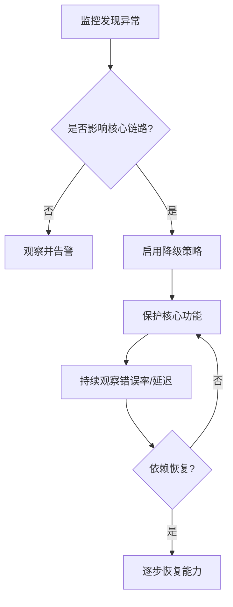

# 降级

## 定义

降级是在依赖不可用、压力过高或风险变大时，主动牺牲部分非核心能力以保护核心链路的策略。它让系统从“全部失败”变成“核心功能可用，次要功能受限”。

## 常见方式

- 返回缓存数据或默认值。
- 隐藏推荐、排行榜、个性化等非核心模块。
- 关闭高成本功能或切到只读模式。
- 用 [[Feature Flag]] 控制能力开关。

## 降级流程

## 案例

电商首页依赖推荐服务、库存服务和广告服务：

- 推荐服务超时：返回热门商品缓存。
- 广告服务失败：隐藏广告位，不影响购买。
- 库存服务异常：商品详情页保留浏览，但下单按钮提示稍后重试。

这里的核心链路是“用户能否浏览和下单”。推荐和广告可以降级，库存和支付则需要更谨慎，不能用假数据继续交易。

## 降级策略设计

- **读降级**：返回缓存、默认值、静态页面。
- **写降级**：暂停写入、排队、只读模式。
- **功能降级**：关闭次要模块。
- **体验降级**：减少实时刷新、降低推荐精度。
- **人工开关**：通过 [[Feature Flag]] 或配置中心快速启停。

## 设计要点

- 先定义核心链路，再定义可降级能力。
- 降级结果必须对用户和业务可接受。
- 降级要可观测，避免系统长期静默处于低质量状态。
- 降级恢复需要条件和流程，不能只靠手工记忆。

## 常见误区

- 返回默认成功，掩盖真实失败。
- 降级没有告警，导致系统长期处于低质量状态。
- 所有功能都声称不能降级，最终核心链路也被拖垮。
- 恢复时一次性全量放开，造成二次冲击。

## 相关概念

- [[熔断器]]
- [[超时控制]]
- [[Feature Flag]]
- [[灰度发布]]
