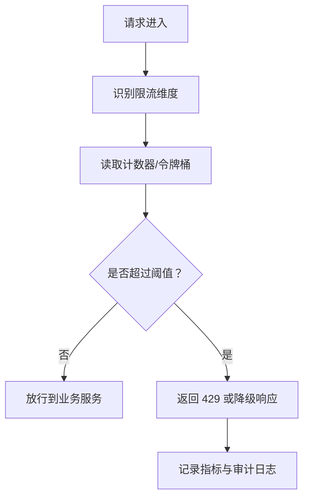

# 限流

## 定义

限流是控制单位时间内请求数量或资源消耗的流量治理手段，用于保护服务、数据库、第三方接口和关键业务链路。它通常和认证、配额、熔断、降级一起使用。

## 常见算法

- 固定窗口：实现简单，但窗口边界可能突增。
- 滑动窗口：统计更平滑，成本更高。
- 漏桶：以固定速率处理请求，适合削峰。
- 令牌桶：允许一定突发流量，更适合 API 网关。

## 请求处理流程

限流必须先明确保护对象：保护登录接口、防止短信滥用、保护数据库、保护第三方 API 配额，使用的维度和阈值会不同。

## 实践要点

- 限流维度可以是用户、租户、IP、接口、应用或业务资源。
- 返回结果要明确，可使用 `429 Too Many Requests`。
- 高价值用户和内部系统可以使用不同配额。
- 限流指标要进入告警和容量规划。

## 算法取舍

| 算法 | 优点 | 风险 | 适合场景 |
|---|---|---|---|
| 固定窗口 | 简单、成本低 | 窗口边界突刺 | 后台低风险接口 |
| 滑动窗口 | 更平滑 | 存储和计算成本更高 | 登录、验证码 |
| 漏桶 | 输出速率稳定 | 不适合突发峰值 | 消息消费、写入削峰 |
| 令牌桶 | 允许短暂突发 | 参数不当会放过过多流量 | API 网关、开放平台 |

## 案例

短信验证码接口可以按多个维度限流：

- 同一手机号：1 分钟 1 次，1 天 10 次。
- 同一 IP：1 分钟 20 次，避免批量撞库。
- 同一设备指纹：短时间内失败次数过多进入冷却。
- 同一租户：保护短信供应商预算和通道配额。

这种场景下只按 IP 限流不够，因为攻击者可以换 IP；只按手机号限流也不够，因为攻击者可以批量枚举手机号。

## 检查清单

- 限流阈值是否基于容量、成本或安全目标，而不是拍脑袋。
- 是否区分普通用户、付费用户、内部系统和开放平台调用方。
- 被限流时响应是否明确，前端是否能展示冷却时间。
- 限流数据是否进入监控，用于容量规划和攻击识别。
- 限流失败时是否有兜底，例如网关限流和服务内限流双层保护。
- 限流是否和 [[API 安全基础]]、[[超时控制]]、[[熔断器]] 一起设计。

## 相关概念

- [[SpringBoot/19-SpringBoot-接口限流]]
- [[熔断器]]
- [[API 安全基础]]
- [[Spring Cloud Gateway]]
