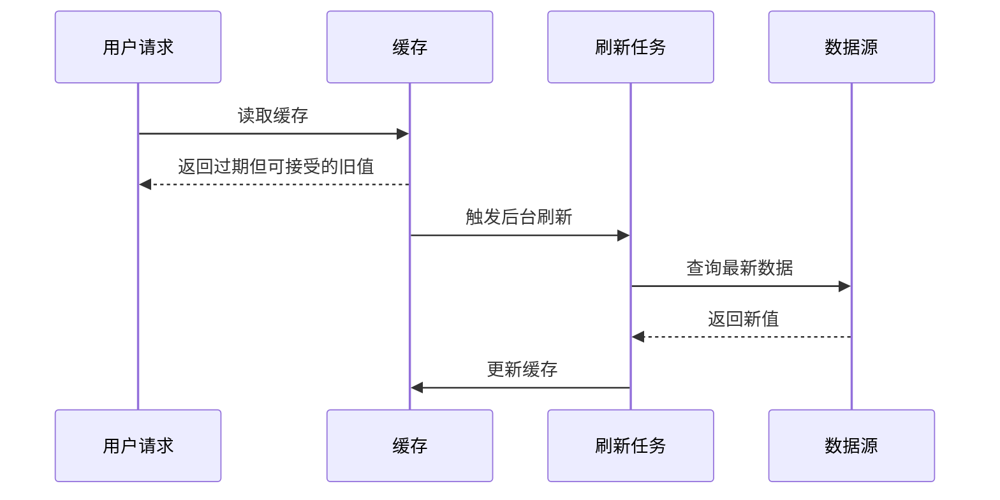

# Stale-While-Revalidate

## 定义

Stale-While-Revalidate 是一种缓存策略：当缓存数据过期后，先返回旧数据保证响应速度，同时在后台异步刷新缓存。它适合允许短暂陈旧但要求高可用和低延迟的读场景。

## 要点

- 用户请求不阻塞在缓存重建上。
- 旧数据必须仍在业务可接受范围内。
- 后台刷新要防止重复并发执行。
- 需要监控旧数据返回比例和刷新失败率。

## 适用场景

- 热门商品详情、排行榜、推荐模块。
- 配置类、内容类、低频变更数据。
- 前端数据获取库中的缓存重新验证策略。

## 请求流程

这个策略把“用户响应”和“缓存刷新”拆开：用户不等待重建，系统在后台恢复新鲜度。

## 案例

排行榜每 5 分钟更新一次，但访问量很高。直接过期删除会在过期瞬间触发大量数据库查询。

可以改为：

- 缓存值包含 `data` 和 `expireAt`。
- 读请求发现逻辑过期后仍返回旧榜单。
- 只有一个后台任务刷新榜单。
- 刷新失败时继续返回旧值并告警。

这种设计适合展示类数据，不适合账户余额、库存扣减、支付状态等强一致场景。

## 和相关模式的区别

- 与 [[缓存击穿]] 治理相关：SWR 可以避免热点 Key 过期瞬间并发重建。
- 与 [[最终一致性]] 相关：它接受短暂旧数据，但必须定义可接受窗口。
- 与前端 [[TanStack-Query]] 相关：用户先看到缓存数据，后台重新验证后刷新 UI。

## 检查清单

- 旧数据最长可返回多久，业务是否接受。
- 后台刷新是否有互斥控制，避免重复刷新。
- 刷新失败是否告警，是否记录连续失败次数。
- 用户界面是否需要显示“数据可能延迟”的提示。
- 是否对强一致数据禁用 SWR。

## 相关概念

- [[热点 Key]]
- [[缓存击穿]]
- [[TanStack-Query]]
- [[缓存系统总览]]
