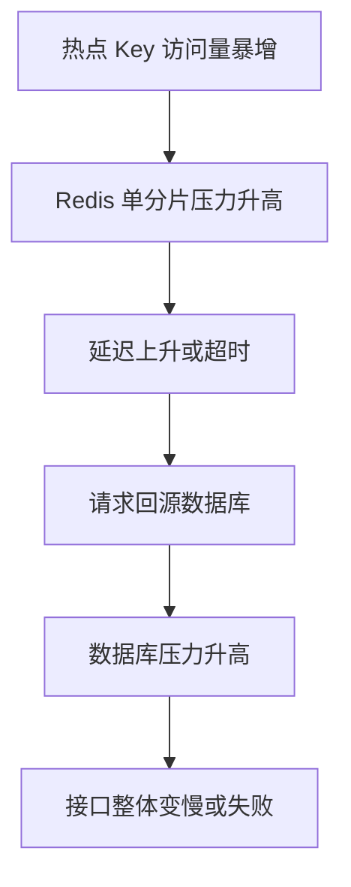

# 热点 Key

## 定义

热点 Key 是在短时间内被大量访问的缓存键，例如热门商品、爆款活动、明星内容或全站配置。热点 Key 会造成单点缓存分片压力、缓存重建压力和下游数据库压力。

## 治理方式

- 提前识别和预热热点数据。
- 使用逻辑过期和异步刷新。
- 本地缓存加分布式缓存形成多级缓存。
- 对超高频 Key 做副本分散或请求合并。

## 风险链路

热点 Key 不是单纯的缓存问题，它会把流量集中到单个分片、单个实例或单个下游资源上，最后演变成系统稳定性问题。

## 识别方式

- Redis 热 Key 统计、慢日志和命令监控。
- 应用层记录 Key 访问频次和 P95/P99 延迟。
- 业务活动、秒杀、热点内容发布前做容量预估。
- 观察缓存命中率突然升高但延迟也升高的异常组合。

## 案例

活动首页配置 `campaign:home:2026` 在大促开始后被所有用户访问。即使命中缓存，单个 Redis 分片也可能被打满。

治理方案：

- 活动开始前预热缓存。
- 在应用内增加短 TTL 本地缓存，减少 Redis 请求。
- 对 Key 做多副本，例如 `campaign:home:2026:0..N` 分散读取。
- 配合 [[Stale-While-Revalidate]]，避免过期瞬间集中重建。

## 检查清单

- 是否知道当前 Top Key 和它们的访问量。
- 热点数据是否有预热、逻辑过期和后台刷新。
- 是否为热点 Key 设置本地缓存或副本分散。
- Key 过期时间是否加随机抖动，避免集中失效。
- 热点故障时是否有 [[降级]] 方案，例如隐藏非核心模块。

## 相关概念

- [[缓存击穿]]
- [[Stale-While-Revalidate]]
- [[缓存系统总览]]
- [[SpringBoot/24-SpringBoot-缓存治理模式]]
