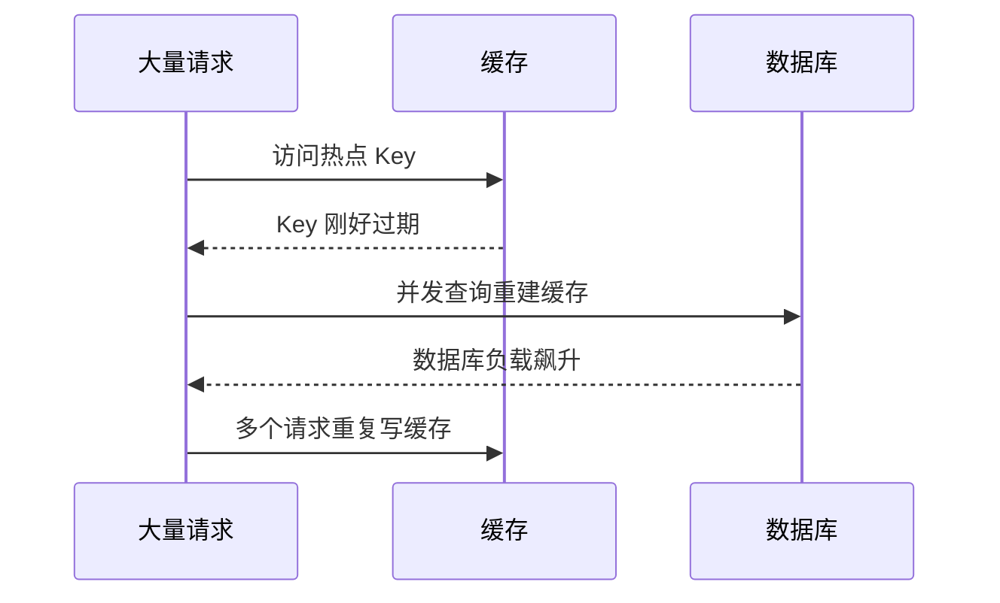
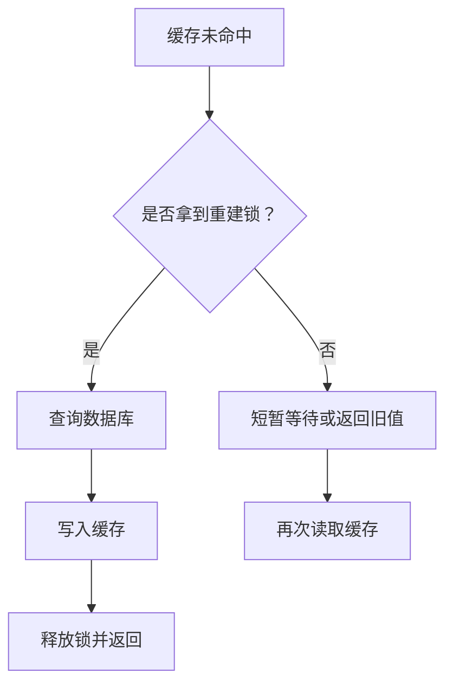

# 缓存击穿

## 定义

缓存击穿是指单个热点 Key 在过期瞬间被大量请求同时访问，所有请求都尝试重建缓存，导致数据库或下游服务瞬时承压。

## 常见方案

- 互斥锁：同一 Key 只允许一个线程重建缓存。
- 逻辑过期：先返回旧值，后台异步刷新。
- 热点 Key 永不过期，配合主动刷新。
- 请求合并：多个相同请求共享同一次加载结果。

## 故障流程

缓存击穿的重点是“热点 Key + 过期瞬间 + 并发重建”。它不同于 [[缓存穿透]]：穿透通常访问不存在的数据；击穿访问的是存在且很热的数据。

## 互斥锁流程

互斥锁要设置过期时间，避免重建线程异常退出后锁一直不释放。等待方也不能无限等待，否则会把缓存问题变成线程池耗尽问题。

## 案例

首页爆款商品 `product:1001` 每秒被访问数千次，TTL 设置为 10 分钟。10 分钟到期瞬间，大量请求同时未命中，数据库被并发打满。

改进方案：

- 爆款商品使用逻辑过期，前台先返回旧值。
- 后台只有一个线程刷新缓存。
- 发布商品变更时主动删除或刷新缓存。
- 对刷新失败设置告警，避免长期返回过旧数据。

## 检查清单

- 是否识别了热点 Key，并对它们使用不同于普通 Key 的策略。
- 缓存重建是否有互斥、请求合并或后台刷新。
- 锁是否有过期时间和唯一值校验，防止误删别人的锁。
- 旧值可返回多久，是否符合业务一致性要求。
- 数据库是否有保护措施，例如 [[限流]]、[[熔断器]] 或降级。

## 相关概念

- [[热点 Key]]
- [[Stale-While-Revalidate]]
- [[缓存穿透]]
- [[SpringBoot/24-SpringBoot-缓存治理模式]]
