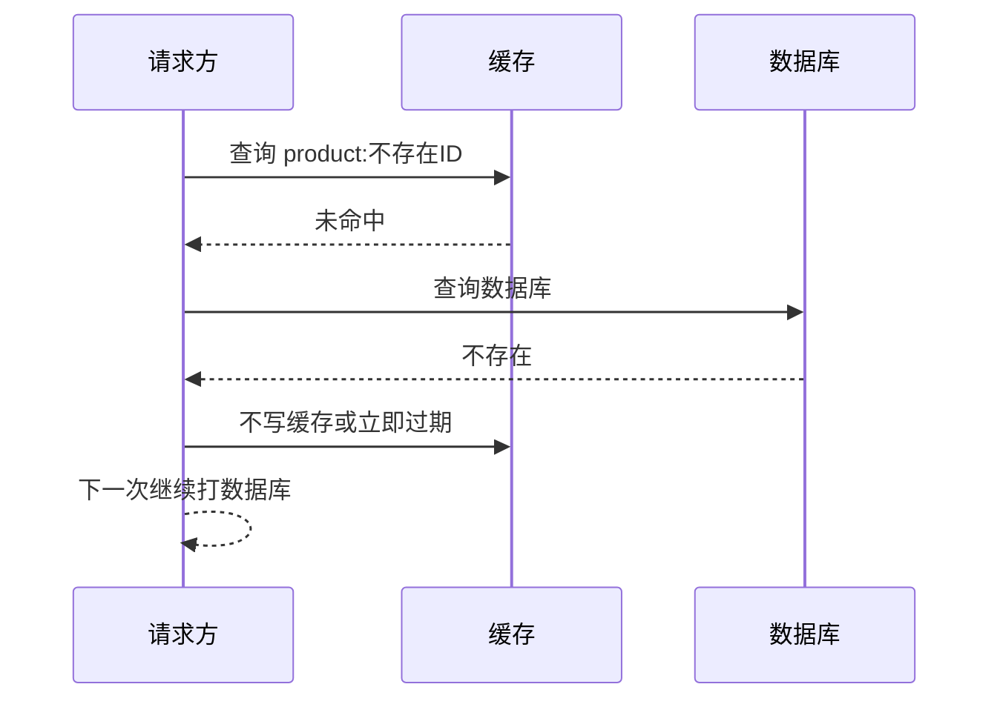

# 缓存穿透

## 定义

缓存穿透是指请求查询的数据既不在缓存中，也不在数据库中，导致每次请求都绕过缓存打到数据库。恶意构造不存在 ID 或热点空数据都可能造成穿透。

## 常见方案

- 缓存空值，并设置较短 TTL。
- 使用布隆过滤器判断请求的 Key 是否可能存在。
- 对明显非法参数提前拦截。
- 对异常高频空查询加限流和风控。

## 故障流程

缓存穿透的危险在于“无效请求不会被缓存吸收”。如果攻击者持续构造不存在的 ID，数据库会承担所有压力。

## 方案取舍

| 方案 | 优点 | 风险 | 适合场景 |
|---|---|---|---|
| 空值缓存 | 实现简单，见效快 | 空值过多占内存，TTL 过长影响新数据可见 | 少量不存在 Key |
| 布隆过滤器 | 能在缓存前快速拦截大量非法 Key | 有误判率，删除和重建复杂 | 大规模 ID 查询 |
| 参数校验 | 成本低，提前拦截明显非法请求 | 只能挡格式错误，挡不住合法范围内的不存在 ID | ID、分页、枚举参数 |
| 限流风控 | 保护数据库 | 可能误伤真实用户 | 恶意扫描、爬虫、撞库 |

## 掘金文章补充

掘金文章《Redis 缓存三大经典问题：穿透、击穿与雪崩》补充了一个容易忽略的点：布隆过滤器不是“放上去就安全”，它本身也有数据同步问题。数据库新增合法数据后，如果布隆过滤器没有及时更新，可能把新数据误判为不存在，造成真实请求被拦截。因此布隆过滤器要配合增量同步、定期重建、失败补偿或降级查询。

空值缓存也要控制边界：空结果应使用短 TTL，并区分“确实不存在”和“下游异常导致没查到”。如果数据库超时却写入空值，会把临时故障固化成缓存结果。

来源：[Redis 缓存三大经典问题：穿透、击穿与雪崩](https://juejin.cn/post/7621473056616742955)

## 案例

商品详情接口 `/products/{id}` 被批量请求随机 ID。大部分 ID 不存在，缓存和数据库都没有数据。

改进方案：

- 先校验 ID 格式和范围，明显非法直接返回 400。
- 对“不存在商品”写入空值缓存，TTL 30 到 120 秒并加随机抖动。
- 商品 ID 总量很大时增加布隆过滤器，判断 ID 是否可能存在。
- 对同一 IP、用户或设备的高频空查询接入 [[限流]]。

## 检查清单

- 空值缓存是否有较短 TTL，避免新建数据后长时间查不到。
- 空值缓存是否加随机过期，避免批量过期造成压力。
- 布隆过滤器是否有初始化、增量更新和重建策略。
- 不存在数据的响应是否与 [[前后端接口契约]] 保持一致。
- 高风险接口是否记录空查询比例，用于识别异常流量。

## 相关概念

- [[缓存系统总览]]
- [[缓存击穿]]
- [[缓存雪崩]]
- [[限流]]
- [[SpringBoot/24-SpringBoot-缓存治理模式]]
