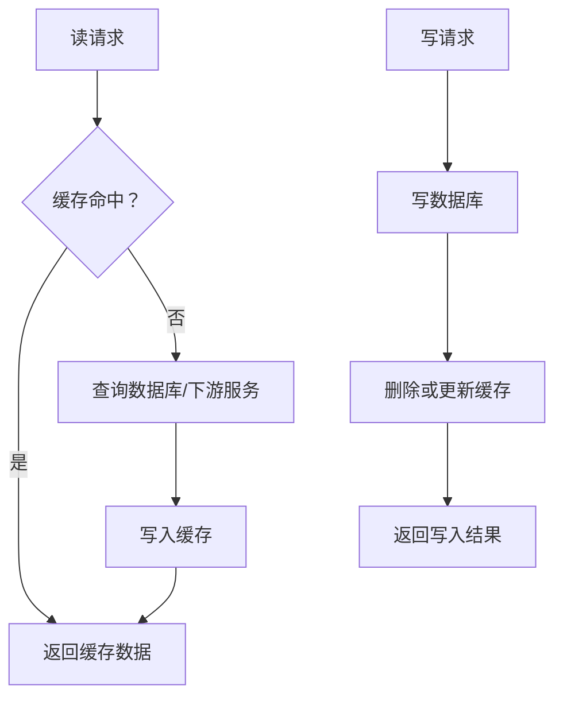

# 缓存系统总览

## 定义

缓存系统是在数据源与请求方之间保存热点数据、副本或计算结果的系统设计方法。它用空间换时间，降低延迟和后端负载，但也引入一致性、失效、容量、穿透、击穿和雪崩等治理问题。

## 缓存层级

- 浏览器缓存：静态资源、HTTP 缓存头和 Service Worker。
- CDN 缓存：边缘节点缓存静态资源和部分公开接口。
- 应用本地缓存：进程内热点数据，速度快但一致性弱。
- 分布式缓存：如 Redis，适合共享缓存、会话、计数器和限流。
- 数据库缓存：查询缓存、物化视图或读模型。

## 核心问题

- 缓存命中率、过期时间和淘汰策略。
- 缓存穿透、缓存击穿、缓存雪崩。
- 缓存与数据库一致性，尤其是写入后的失效时机。
- 热点 Key、Big Key、缓存预热和降级策略。

## 工程实践

- 先明确数据是否允许短暂不一致，再设计缓存策略。
- 对强一致写路径谨慎使用缓存，优先保证主库语义清晰。
- 热点数据配合预热、互斥锁、随机过期和多级缓存。
- 缓存指标至少包含命中率、延迟、内存、连接数和错误率。

## 读写流程

常见策略是“先写数据库，再删除缓存”。如果先删缓存再写数据库，中间有读请求可能把旧数据重新写回缓存。对一致性要求更高的场景，还要配合延迟双删、消息通知或读模型重建。

## 缓存策略选择

- **Cache Aside**：应用先查缓存，未命中再查数据库并回填，最常见。
- **Read Through**：缓存层负责加载数据，应用只访问缓存接口。
- **Write Through**：写入同时更新缓存和数据源，读一致性更好但写延迟更高。
- **Write Behind**：先写缓存，异步写数据源，吞吐高但丢数据风险更大。
- **Refresh Ahead**：热点数据过期前提前刷新，适合可预测热点。

## 案例

商品详情缓存可以这样设计：

- 商品基础信息：变化少，TTL 较长，后台发布商品时主动失效。
- 库存：变化快，TTL 很短或直接查库存服务。
- 促销：有明确开始结束时间，可按活动时间设置过期。
- 评论摘要：允许短暂不一致，可异步刷新。

同一个页面不同 section 的一致性要求不同，不应套用同一个缓存 TTL。

## 检查清单

- 数据是否允许短暂不一致，一致性窗口是多少。
- Key 命名是否包含业务维度、版本和租户隔离。
- TTL 是否加入随机抖动，避免同一时刻大量过期。
- 热点 Key 是否有预热、互斥重建或逻辑过期。
- Big Key 是否拆分，避免阻塞 Redis 和网络传输。
- 缓存失败时系统是直接失败、查数据库，还是进入 [[降级]]。

## 掘金补充

掘金文章《Redis 缓存三大经典问题：穿透、击穿与雪崩》适合补充三类问题的工程边界：

- 穿透：先做参数校验，再考虑布隆过滤器和缓存空值；布隆过滤器要关注误判、增量同步和补偿机制。
- 击穿：关键是避免同一热点 Key 失效后并发打库，可用互斥锁、单飞、预热、自动续期或逻辑过期。
- 雪崩：既可能来自大量 Key 同时过期，也可能来自缓存集群不可用，需要 TTL 随机抖动、降级、熔断和限流一起设计。

落地时不要只记方案名，要把它们映射到业务容忍度：缓存空值会占内存，逻辑过期会返回旧值，互斥锁会增加等待，布隆过滤器会带来同步一致性问题。缓存治理本质上是在数据库保护、数据新鲜度、用户体验和系统复杂度之间取舍。

来源：[Redis 缓存三大经典问题：穿透、击穿与雪崩](https://juejin.cn/post/7621473056616742955)

## 相关概念

- [[Redis/Docker启动Redis|Redis]]
- [[SpringBoot/24-SpringBoot-缓存治理模式]]
- [[最终一致性]]
- [[缓存击穿]]
- [[缓存穿透]]
- [[缓存雪崩]]
- [[热点 Key]]
- [[Web Vitals 与前端性能监控总览]]
- [[熔断器]]
