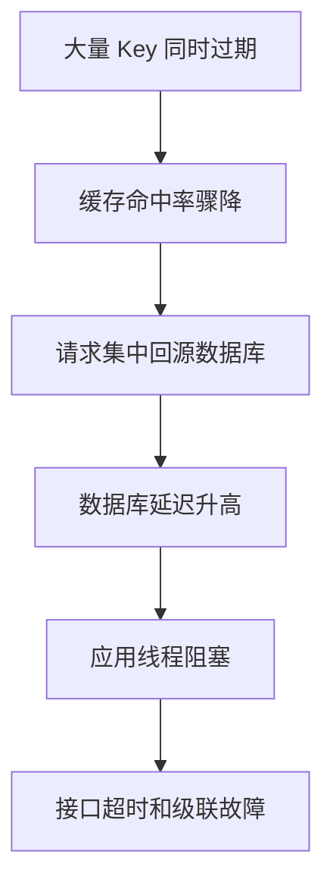

# 缓存雪崩

## 定义

缓存雪崩是大量缓存同时失效或缓存集群整体不可用，导致流量集中打到数据库或核心服务的故障模式。它影响范围通常比 [[缓存击穿]] 更大。

## 常见方案

- 为 TTL 添加随机抖动，避免同一时间大面积过期。
- 多级缓存和本地缓存兜底。
- 缓存集群高可用部署。
- 对数据库访问加 [[限流]]、[[降级]] 和 [[熔断器]]。

## 故障流程

缓存雪崩和 [[缓存击穿]] 的区别在于影响范围：击穿通常是单个热点 Key，雪崩是大量 Key 或整个缓存层同时失效。

## 案例

活动系统把所有活动商品缓存都设置为整点过期。整点后缓存同时失效，数据库承受瞬时高峰。

改进方案：

- TTL 加随机抖动，例如 `baseTtl + random(0, 300s)`。
- 活动开始前预热热点数据。
- 本地缓存兜底核心配置。
- 缓存不可用时对非核心接口 [[降级]]。
- 数据库入口加 [[限流]]，避免被回源流量打垮。

## 掘金文章补充

掘金文章《Redis 缓存三大经典问题：穿透、击穿与雪崩》强调雪崩有两种来源：一批 Key 同时过期，或缓存层整体不可用。前者主要靠 TTL 随机偏移、预热和分批刷新治理；后者要准备降级、熔断和数据库保护，而不是让所有请求直接回源。

判断是否雪崩时，重点看缓存命中率是否整体下降、Redis 错误率是否上升、数据库 QPS 是否突然放大。如果只是单个热点 Key 过期，更接近 [[缓存击穿]]；如果是大面积 Key 或缓存集群故障，就要按雪崩处理，优先保护核心链路。

来源：[Redis 缓存三大经典问题：穿透、击穿与雪崩](https://juejin.cn/post/7621473056616742955)

## 检查清单

- TTL 是否集中在同一时间点过期。
- 热点数据是否预热，并有刷新失败告警。
- 缓存集群是否高可用，是否跨节点分片。
- 应用是否有本地缓存或默认配置兜底。
- 数据库是否有保护阈值、限流和慢查询监控。

## 恢复步骤

缓存雪崩发生后，优先保护数据库和核心写链路：先启用限流和降级，再逐步预热核心 Key，最后恢复非核心流量。不要在数据库已经过载时让所有应用实例同时重建缓存，否则会延长故障时间。

## 相关概念

- [[缓存系统总览]]
- [[缓存穿透]]
- [[缓存击穿]]
- [[SpringBoot/24-SpringBoot-缓存治理模式]]
