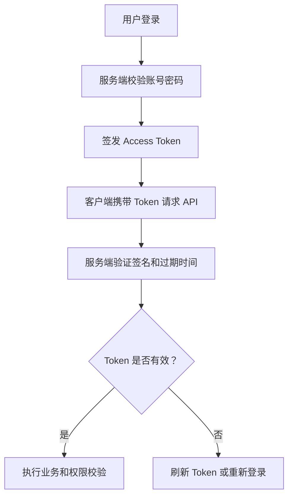

# JWT 登录认证完整流程

## 定义

JWT 登录认证流程是用户登录成功后由服务端签发 Token，客户端后续请求携带 Token，服务端验证签名、有效期和权限声明的认证方式。

## 流程

1. 用户提交账号密码。
2. 服务端校验身份并签发 Access Token。
3. 客户端请求携带 Token。
4. 服务端验证签名、过期时间和权限。
5. Token 过期后通过刷新机制或重新登录续期。

## 要点

- JWT 撤销和黑名单需要额外设计。
- 不应在 Token 中放敏感明文信息。
- 前端存储策略要结合 [[前端鉴权与 Token 存储安全]]。

## 完整流程图

## 实践检查清单

- Token 是否有合理过期时间和签名算法。
- 是否区分 Access Token 和 Refresh Token。
- 是否设计退出登录、改密、封禁后的撤销机制。
- 后端是否在每次敏感请求中重新校验权限。
- 前端是否区分 401 未认证和 403 无权限。

## 案例

后台系统可以使用短期 Access Token 访问 API，Refresh Token 存在 HttpOnly Cookie 中。Access Token 过期后尝试刷新；刷新失败则清理状态并跳转登录页。

## 相关概念

- [[认证授权总览：Session、JWT、OAuth2 与 OIDC]]
- [[SpringBoot/09-SpringBoot-JWT认证]]
- [[RBAC 权限模型设计]]
