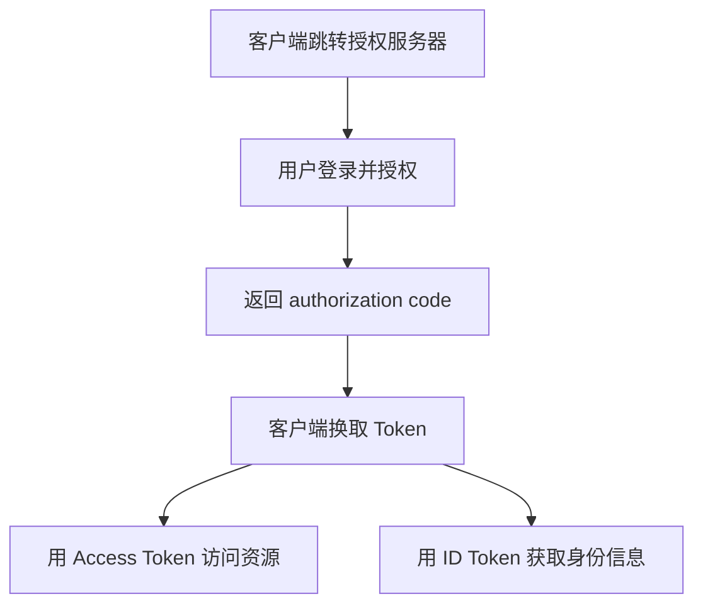

# OAuth2 与 OIDC 核心概念

## 定义

OAuth2 是授权框架，允许第三方应用代表用户访问资源；OIDC 是建立在 OAuth2 之上的身份认证层，用于获取标准化用户身份信息。

## 要点

- OAuth2 解决“能访问什么资源”。
- OIDC 解决“用户是谁”。
- 授权码模式配合 PKCE 是现代 Web 与移动应用常见选择。
- Access Token 面向资源服务器，ID Token 面向客户端身份信息。

## 授权码流程

## 实践检查清单

- 是否区分认证和授权。
- Web/移动端是否使用授权码 + PKCE。
- Access Token 是否只给资源服务器使用。
- ID Token 是否只用于客户端识别用户身份。
- 回调地址、scope、state 是否校验。

## 案例

第三方登录通常需要 OIDC：用户在身份提供方登录后，客户端拿到 ID Token 识别用户是谁；若还要调用用户资源 API，则使用 Access Token 请求资源服务器。

## 安全边界

OAuth2/OIDC 的安全关键在回调地址、state、PKCE、Token 有效期和客户端类型。前端应用不能保存客户端密钥，公共客户端必须假设本地环境不可信。

## 相关概念

- [[认证授权总览：Session、JWT、OAuth2 与 OIDC]]
- [[单点登录 SSO 实践]]
- [[前端鉴权与 Token 存储安全]]
