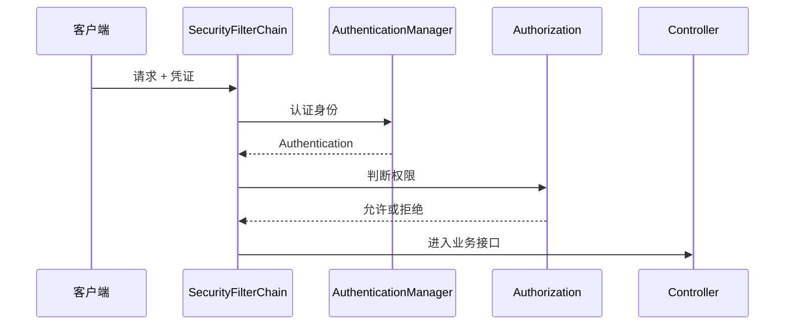

# Spring Security 入门

## 定义

Spring Security 是 Spring 生态的安全框架，用于处理认证、授权、会话、安全过滤器链、密码加密和常见 Web 安全防护。

## 要点

- SecurityFilterChain 是请求安全处理的核心入口。
- Authentication 表示用户身份，Authorization 判断访问权限。
- 密码必须使用 BCrypt 等安全哈希算法。
- 前后端分离项目常结合 Session、JWT 或 OAuth2。

## 过滤器链流程



Spring Security 的核心心智模型是过滤器链：请求先经过安全过滤器，完成认证和授权后才进入业务 Controller。

## 最小配置示例

```java
@Bean
SecurityFilterChain securityFilterChain(HttpSecurity http) throws Exception {
    return http
            .authorizeHttpRequests(auth -> auth
                    .requestMatchers("/api/public/**").permitAll()
                    .anyRequest().authenticated()
            )
            .csrf(csrf -> csrf.disable())
            .build();
}
```

前后端分离项目关闭 CSRF 前，要确认凭证是否通过 Cookie 自动携带。如果使用 Cookie 登录态，仍需要结合 [[CSRF 攻击与防护]] 设计。

## 检查清单

- 密码是否使用 BCrypt、Argon2 等安全哈希，不保存明文。
- 认证失败和权限不足是否分别返回 401、403。
- 接口权限是否在服务端校验，前端按钮隐藏不算授权。
- JWT、Session、OAuth2 的选择是否符合 [[认证授权总览：Session、JWT、OAuth2 与 OIDC]]。
- 高风险接口是否结合 [[API 安全基础]] 做资源级权限校验。
- 安全配置是否有测试覆盖公开接口、登录接口和受保护接口。

## 相关概念

- [[认证授权总览：Session、JWT、OAuth2 与 OIDC]]
- [[JWT 登录认证完整流程]]
- [[RBAC 权限模型设计]]
- [[API 安全基础]]
