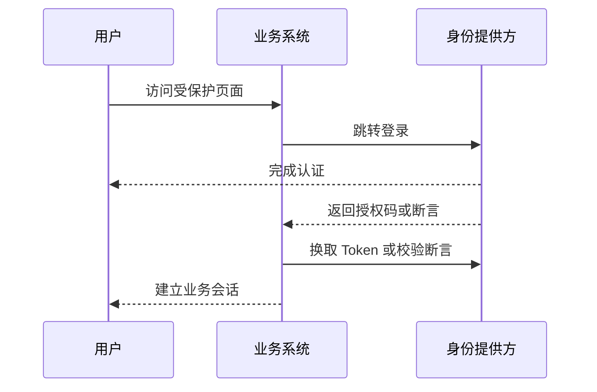

# 单点登录 SSO 实践

## 定义

单点登录让用户在统一身份提供方登录一次后，可以访问多个相互信任的系统，常通过 OIDC、SAML 或统一 Session 域实现。

## 要点

- 核心是统一身份提供方和业务系统之间的信任关系。
- 需要处理登录跳转、Token 校验、退出登录和会话过期。
- 多系统权限仍需各自根据业务资源校验。

## 相关概念

- [[OAuth2 与 OIDC 核心概念]]
- [[认证授权总览：Session、JWT、OAuth2 与 OIDC]]
- [[RBAC 权限模型设计]]

## 登录流程

## 实践检查清单

- 回调地址是否白名单校验，避免开放重定向。
- Token 是否校验签名、过期时间、issuer、audience 和 nonce。
- 单点退出是否明确影响范围，避免误退全部系统或无法退出。
- 业务系统是否仍做资源级权限校验，而不是只看是否登录。
- 用户、组织、角色等身份属性是否有同步和失效策略。

## 案例

企业内部多个后台系统接入统一 OIDC。用户在身份平台登录后，业务系统只把身份认证结果转换为本系统会话；是否能查看订单、导出报表仍由各系统按 RBAC 或资源权限判断。

## 常见误区

- 把 SSO 等同于权限系统，登录成功后放开所有资源。
- 只处理登录，不处理 Token 续期、退出和账号禁用。
- 多系统使用不同用户标识，导致审计和权限同步混乱。
