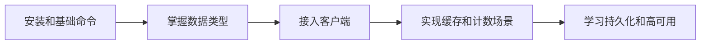

# Redis 学习路线

> 来源: 掘金文章《Redis 入门》  
> 整理时间: 2026-03-03

---
## 📚 学习阶段规划

### 阶段一：基础入门（1-2天）

| 主题 | 内容 | 目标 |
|------|------|------|
| NoSQL 概念 | 了解非关系型数据库、NoSQL 分类 | 知道 Redis 是什么 |
| Redis 介绍 | 发展史、特点、应用场景 | 理解为什么用 Redis |
| 数据类型 | String、Hash、List、Set、SortedSet | 掌握5种基本类型 |

**关键知识点：**
- Redis 是 C 语言开发的高性能键值数据库
- 应用场景：缓存、Session 分离、排行榜、任务队列、计数器等

---

### 阶段二：环境搭建（1天）

| 主题 | 内容 |
|------|------|
| 安装部署 | Linux 下编译安装、Windows 安装 |
| 启动方式 | 前端启动 vs 后端启动（daemonize）|
| 配置文件 | redis.conf 基础配置 |
| 客户端连接 | redis-cli、查看进程、关闭服务 |

**重要命令：**
```bash
# 后端启动
./redis-server redis.conf

# 查看进程
ps -aux | grep redis

# 关闭服务
./redis-cli shutdown
```

---

### 阶段三：命令操作（2-3天）

| 数据类型          | 核心命令                         |
| ------------- | ---------------------------- |
| **String**    | SET、GET、INCR、DECR、EXPIRE     |
| **Hash**      | HSET、HGET、HGETALL、HDEL       |
| **List**      | LPUSH、RPUSH、LPOP、RPOP、LRANGE |
| **Set**       | SADD、SMEMBERS、SISMEMBER、SREM |
| **SortedSet** | ZADD、ZRANGE、ZREVRANGE、ZSCORE |

**选择数据库：**
```bash
# 选择第16个数据库（下标从0开始）
select 15
```

---

### 阶段四：Java 开发（2-3天）

| 主题 | 内容 |
|------|------|
| Jedis 客户端 | 单例连接、连接池配置 |
| Spring 整合 | JedisPool 配置、RedisTemplate |
| 工具类封装 | 通用 Redis 工具类 |
| 连接池参数 | maxTotal、maxIdle、numTestsPerEvictionRun |

**Maven 依赖：**
```xml
<dependency>
    <groupId>redis.clients</groupId>
    <artifactId>jedis</artifactId>
    <version>2.7.0</version>
</dependency>
<dependency>
    <groupId>org.apache.commons</groupId>
    <artifactId>commons-pool2</artifactId>
    <version>2.3</version>
</dependency>
```

**Spring 配置示例：**
```xml
<!-- 连接池配置 -->
<bean id="jedisPoolConfig" class="redis.clients.jedis.JedisPoolConfig">
    <!-- 最大连接数 -->
    <property name="maxTotal" value="30" />
    <!-- 最大空闲连接数 -->
    <property name="maxIdle" value="10" />
</bean>
```

---

### 阶段五：进阶实战（持续）

| 主题 | 应用场景 |
|------|----------|
| **缓存** | 数据查询缓存、页面缓存 |
| **Session 共享** | 分布式集群 Session 分离 |
| **排行榜** | SortedSet 实现实时排行 |
| **计数器** | 网站访问统计、点赞数 |
| **队列** | 秒杀、抢购、任务队列 |
| **分布式锁** | 防重复提交、并发控制 |

---

## 🛠️ 实践项目建议

1. **用户登录缓存** - Session + Token 存储
2. **商品秒杀系统** - List 队列 + 原子操作
3. **排行榜功能** - SortedSet 实现热榜
4. **接口限流** - 滑动窗口计数器

---

## 📖 推荐资源

- 官方文档：https://redis.io/documentation
- 在线练习：http://try.redis.io/
- 图形工具：Redis Desktop Manager
- GitHub Jedis：https://github.com/xetorthio/jedis

---

## 📝 学习检查清单

- [ ] 理解 NoSQL 和关系型数据库的区别
- [ ] 完成 Redis 安装和启动
- [ ] 掌握 5 种数据类型的基本操作
- [ ] 使用 Jedis 完成 CRUD 操作
- [ ] 配置连接池并理解参数含义
- [ ] 完成至少一个实战项目

---

## 标签

#Redis #NoSQL #缓存 #Java #Jedis #学习路线

## 实践流程



## 实践检查清单

- 是否能解释 String、Hash、List、Set、Sorted Set 的适用场景。
- 是否理解 TTL、淘汰策略和缓存穿透/击穿/雪崩。
- 客户端是否使用连接池和超时设置。
- 是否验证持久化、备份和恢复。
- 是否区分缓存数据和关键业务数据。

## 案例

学习排行榜时，可以用 Sorted Set 实现用户分数排名，再扩展到定时清理、分页查询和并发更新。

## 常见误区

- 只会命令，不理解内存、持久化和高可用。
- 把 Redis 当主数据库保存关键数据。
- 没设置 TTL 和容量监控，缓存长期膨胀。
