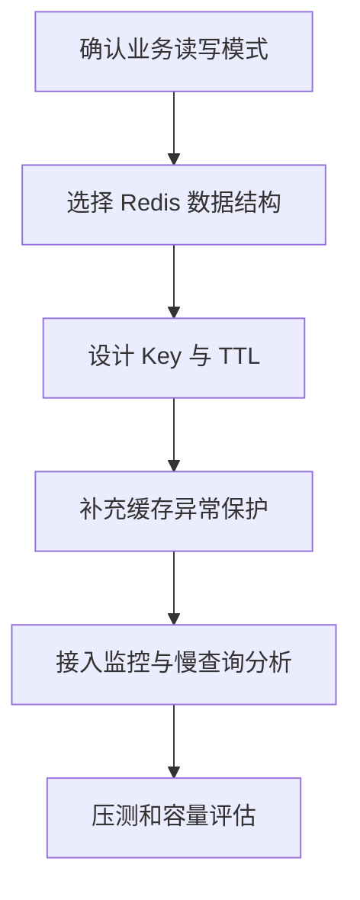

# Redis 学习资料汇总

> Redis 从入门到实战的完整学习资料

---
## 📚 学习路线

---

## 📁 文档目录

| 文档 | 内容 | 难度 |
|------|------|------|
| [01_学习路线](01_学习路线.md) | Redis学习规划、资源推荐 | ⭐ |
| [02_常用命令实战案例](02_常用命令实战案例.md) | 5大数据类型实战案例 | ⭐⭐ |
| [03_缓存问题实战解决方案](03_缓存问题实战解决方案.md) | 穿透/击穿/雪崩解决方案 | ⭐⭐⭐ |

---

## 🎯 快速开始

1. **零基础** → 先看《学习路线》了解全貌
2. **学命令** → 阅读《常用命令实战案例》动手练习
3. **解问题** → 掌握《缓存问题实战解决方案》
4. **做项目** → 结合实际业务场景应用

## 实践检查清单

- 是否能解释 Redis 常用数据结构的适用场景。
- 是否能用 Docker 本地启动 Redis 并连接测试。
- 是否理解缓存穿透、击穿、雪崩的区别。
- 是否知道 Redis 不等于强一致数据库。
- 是否能结合项目设计 Key、TTL 和失效策略。

## 工程使用流程

## 项目案例

电商商品页可以把商品基础信息、类目和标签缓存到 Redis，读取时先查缓存，未命中再回源数据库。上线前需要补齐随机 TTL、空值缓存、热点商品预热和回源限流，否则在促销流量下容易引发 [[缓存击穿]] 或 [[缓存雪崩]]。

## 相关概念

- [[Redis]]
- [[缓存系统总览]]
- [[缓存穿透]]
- [[缓存击穿]]
- [[缓存雪崩]]

---

## 标签

#Redis #缓存 #学习路线 #实战案例
