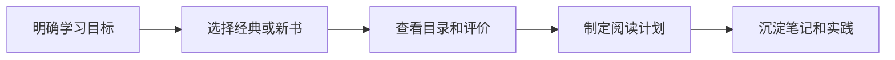

# 技术书籍
技术书籍用于沉淀系统性学习资源和阅读清单。

## 相关概念
- [[持续学习]]

## 筛选流程

## 实践检查清单

- 书籍是否匹配当前阶段的问题，而不是只因为热门。
- 是否优先选择有体系、有案例、有练习的资料。
- 阅读后是否转化为原子笔记、代码实验或项目复盘。
- 是否区分入门书、参考书和进阶书。
- 是否定期清理长期未读的愿望清单。

## 案例

学习数据库索引时，可以先读数据库原理章节，再结合项目慢查询做执行计划分析，把结论沉淀到 [[PostgreSQL 索引原理与优化]] 或 MySQL 索引笔记中。

## 常见误区

- 囤书替代学习，没有输出和实践。
- 只读工具教程，不补底层原理。
- 同一主题同时读太多书，缺少主线。
