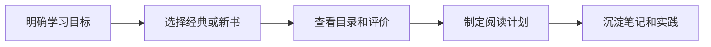

# 技术书籍
技术书籍用于沉淀系统性学习资源和阅读清单。

## 相关概念
- [[持续学习]]

## 筛选流程

## 实践检查清单

- 书籍是否匹配当前阶段的问题，而不是只因为热门。
- 是否优先选择有体系、有案例、有练习的资料。
- 阅读后是否转化为原子笔记、代码实验或项目复盘。
- 是否区分入门书、参考书和进阶书。
- 是否定期清理长期未读的愿望清单。

## 案例

学习数据库索引时，可以先读数据库原理章节，再结合项目慢查询做执行计划分析，把结论沉淀到 [[PostgreSQL 索引原理与优化]] 或 MySQL 索引笔记中。

## 常见误区

- 囤书替代学习，没有输出和实践。
- 只读工具教程，不补底层原理。
- 同一主题同时读太多书，缺少主线。

## 复盘问题

- 这本书解决的是当前真实问题，还是只是收藏焦虑。
- 阅读后是否产出了原子笔记、代码实验、项目复盘或决策变化。
- 书中的原则是否在实际项目里被验证，哪些内容需要结合上下文调整。

## 阅读输出

技术书籍适合补体系，但不适合停留在摘抄。每一章至少要提炼一个可迁移问题，例如“这个原则在当前项目中如何落地”“哪些前提在我的场景不存在”“是否有反例”。读工具书时重点保留查阅路径、版本差异和典型配置；读原理书时重点沉淀模型、边界和推导过程。若一本书长期没有输出，可以降级为参考资源；若它改变了项目决策，则需要回链到相关项目或专题笔记，保留决策依据。

## 使用边界

书籍内容通常比官方文档更稳定，但也可能落后于框架版本和云服务能力。用于工程决策时，应把原则与当前技术栈、团队约束和线上数据重新对齐。
