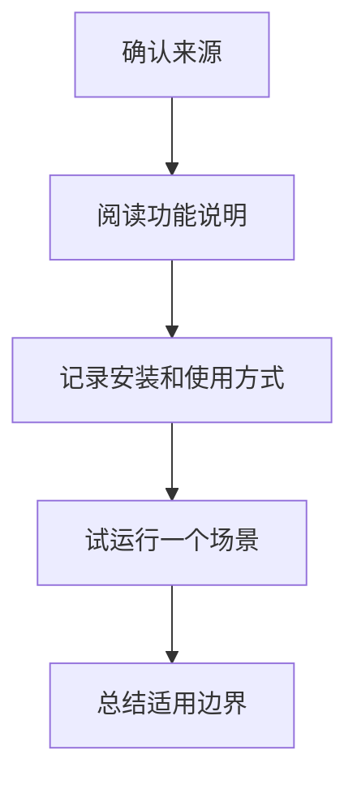

# ClaudeKit.cc
ClaudeKit.cc 是 UI/UX 与 Claude 工作流相关资源入口，具体价值需要后续根据来源内容补充。

## 补充方向

该资源笔记应补齐来源链接、工具定位、适用人群、核心功能、安装方式、示例工作流和与 Claude 生态的关系。当前可作为资源线索，但还不足以作为正式推荐。

## 整理流程

## 实践检查清单

- 是否有官网、仓库或可信介绍。
- 是否说明它解决什么 Claude 工作流问题。
- 是否有最小示例或截图。
- 是否记录收费、权限和数据安全信息。
- 是否和 [[UI-UX-Pro-Max-Skill]]、[[AI工具对比]] 建立清晰关系。

## 案例模板

后续补全时可按“用途、安装、核心命令、输入输出、适合场景、替代方案、风险”整理。未验证前应标注待确认，避免误导。

## 待验证字段

- 来源可信度：域名、作者、仓库、更新频率和社区反馈。
- 功能范围：是提示词集合、UI 组件、Claude 工作流，还是自动化脚本。
- 数据风险：是否需要上传代码、设计稿、密钥或用户数据。
- 成本信息：是否免费、订阅制或按量计费。
- 实测记录：用一个低风险任务跑通后再进入正式工具清单。

如果该资源最终只是教程或灵感库，应标记为参考资源；如果它包含可执行脚本或插件，则需要补安装、卸载和权限说明。

## 常见误区

- 只保存域名，不保存上下文。
- 没有试用就把工具放进正式工作流。

## 相关概念
- [[UI-UX-Pro-Max-Skill]]
- [[AI工具对比]]
