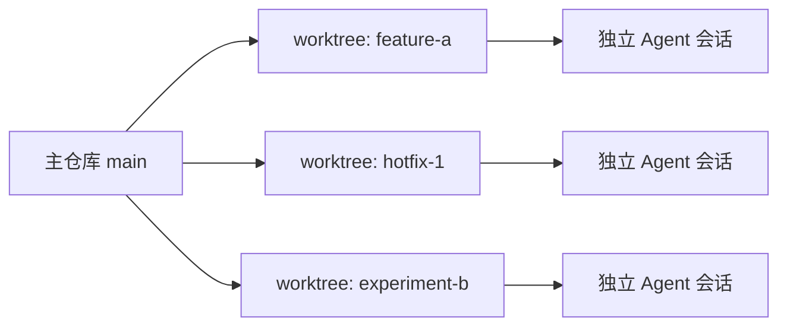

# Git Worktree 并行开发

## 定义

`git worktree` 允许同一个 Git 仓库同时检出多个工作目录。每个目录可以在不同分支上独立开发、运行、测试，适合并行处理多个需求、修复线上问题、对比方案，避免频繁 `stash` 和来回切分支。

它解决的是“物理隔离”的问题：`branch` 是逻辑版本线，`worktree` 是真实工作目录。AI 编程场景下，一个仓库可以同时给多个 Agent 或多个开发任务提供独立目录，减少上下文互相污染。

## 3 个核心命令

### 1. 新建并行工作目录

```bash
git worktree add ../项目名-功能分支 -b feature/功能分支
```

如果远端或本地分支已经存在，可以省略 `-b`：

```bash
git worktree add ../项目名-hotfix hotfix/问题修复
```

### 2. 查看所有工作目录

```bash
git worktree list
```

用来确认当前仓库有哪些并行目录、各自对应哪个分支。

### 3. 删除不再使用的工作目录

```bash
git worktree remove ../项目名-功能分支
```

如果目录已经被手动删除，可以清理 Git 记录：

```bash
git worktree prune
```

## 7 个实践步骤

1. 回到主仓库，确保基线分支是最新的。

```bash
git switch main
git pull --ff-only
```

2. 为新任务创建独立 worktree。

```bash
git worktree add ../项目名-task-a -b feature/task-a
```

3. 进入新目录，安装依赖或复用已有环境。

```bash
cd ../项目名-task-a
```

4. 在该目录中正常开发、测试、提交。

```bash
git status
git add .
git commit -m "实现 task-a"
```

5. 如果中途来了紧急修复，不要打断当前目录，直接再开一个 worktree。

```bash
git worktree add ../项目名-hotfix -b hotfix/urgent-fix
```

6. 每个 worktree 独立推送、开 PR 或合并。

```bash
git push -u origin feature/task-a
```

7. 任务完成后删除对应 worktree，保持本地环境干净。

```bash
cd ../原项目目录
git worktree remove ../项目名-task-a
git worktree prune
```

## 使用场景

- 同时开发两个互不相关的功能。
- 当前分支改到一半，临时需要修线上问题。
- 需要长期保留一个测试分支或版本对照目录。
- 想在不同目录中分别运行不同依赖、环境变量或服务端口。
- 让多个 AI 编程会话并行处理不同任务，每个会话只接触自己的工作目录。
- 对同一个技术方案生成多个 PR 原型，再用真实代码影响范围做比较。

## AI 编程中的使用模式



推荐做法：

- 每个 AI 任务使用独立分支和独立 worktree。
- 任务完成后通过 PR、diff 或测试结果汇总，而不是直接互相覆盖文件。
- 避免多个 worktree 同时修改同一批大文件，否则合并成本会抵消并行收益。
- 长时间运行的任务要定期 `git status` 和 `git worktree list`，防止忘记半成品目录。

## 注意事项

- 同一个分支不能同时被两个 worktree 检出。
- 每个 worktree 是独立工作目录，但共享同一个 `.git` 对象库，磁盘占用通常比完整克隆更小。
- 删除 worktree 前先确认改动已经提交、推送或明确丢弃。
- 建议把 worktree 目录放在主仓库旁边，例如 `../repo-feature-x`，避免嵌套在仓库内部。
- `.env`、`node_modules` 等未被 Git 管理的文件不会自动跟随 worktree，需要单独处理。

## 非 Git 文件处理

- `.env`：可以软链接到主仓库的本地环境文件，但要确认不同任务是否需要不同配置。

```bash
ln -s ../repo/.env ../repo-feature-a/.env
```

- `node_modules`：建议在每个 worktree 中重新安装依赖，尤其是前端项目和 monorepo，避免版本、构建缓存和平台产物互相干扰。

```bash
pnpm install
```

## 记忆口诀

`add` 开分身，`list` 看分身，`remove` 收分身。

## 相关概念

- [[Git 基础]]
- [[分支管理]]
- [[Rebase]]
- [[冲突解决]]

## 参考资料

- Git 官方文档：`git help worktree`
- [[3 个命令 7 个步骤，学会 git worktree 并行开发]]

## 实践检查清单

- 创建 worktree 前是否确认基线分支最新。
- 每个 worktree 是否使用独立分支和清晰目录名。
- 是否避免在不同 worktree 中修改同一大文件，减少冲突。
- 删除 worktree 前是否确认改动已提交、推送或明确放弃。
- 是否定期 `git worktree list` 和 `git worktree prune` 清理废弃目录。

## 案例

当前功能分支正在重构，线上突然需要修登录问题。可以保留当前 worktree 不动，另开 `../repo-hotfix-login`，从主分支拉出 hotfix 分支修复并发布，避免在半成品目录里来回 stash。

## 常见误区

- 把 worktree 建在仓库内部，造成嵌套和工具扫描混乱。
- 同一个任务开太多 worktree，最后忘记哪个目录有未提交改动。
- 删除目录而不使用 `git worktree remove`，留下损坏记录。
