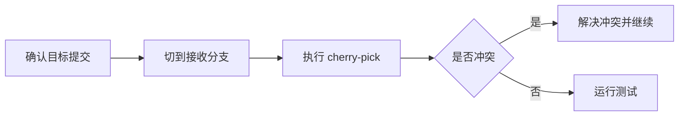

# Cherry Pick
Cherry Pick 用于把某个特定提交应用到当前分支，适合挑选修复或单独迁移变更。

## 相关概念
- [[Git 基础]]
- [[分支管理]]

## 使用流程

## 实践检查清单

- 是否确认提交是独立的，不依赖未迁移的前置提交。
- 是否在正确目标分支执行操作。
- 冲突解决后是否运行相关测试。
- 是否保留原提交信息，方便追溯来源。
- 多个提交是否按原顺序迁移。

## 案例

生产分支需要快速带上主分支中的一个空指针修复，可以 cherry-pick 对应修复提交到 release 分支，再跑回归测试并发布补丁版本。

## 常见误区

- 随意挑选大功能中的中间提交，导致依赖缺失。
- 冲突解决时误删目标分支已有修复。
- cherry-pick 后不测试，以为提交能自动适配目标分支。
