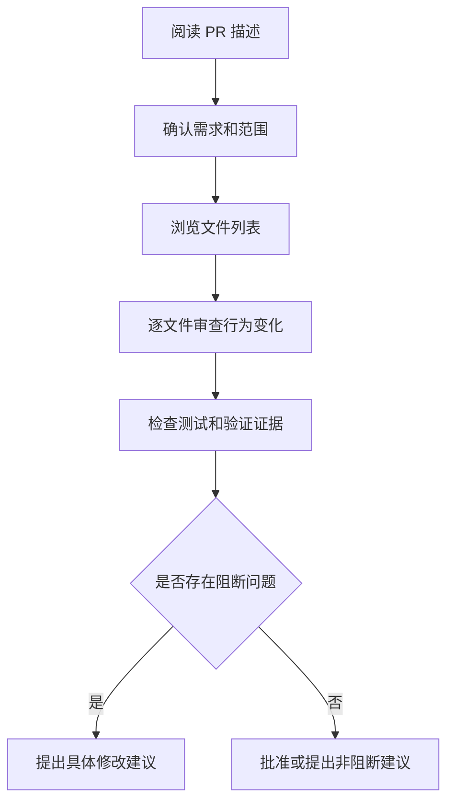

# Code Review

## 定义

Code Review 是通过同行审查发现缺陷、设计风险、可维护性问题和测试缺口的工程实践。它不是单纯挑代码风格，而是确认改动是否正确、可维护、可验证，并且符合团队约定。

## 审查重点

- **正确性**：逻辑是否覆盖边界条件，是否引入回归。
- **可维护性**：命名、结构、职责边界是否清晰。
- **安全性**：输入验证、权限控制、敏感数据处理是否可靠。
- **性能**：是否引入不必要的循环、请求、渲染或数据库压力。
- **测试**：是否有能证明行为的单元、集成或端到端测试。
- **可观测性**：关键失败是否有日志、指标或错误上报。

## 审查流程

## 好的评论格式

- 指出具体文件和行。
- 说明风险或失败场景。
- 给出可执行建议。
- 区分阻断问题和偏好建议。

示例：

> 这里直接信任前端传入的 `userId` 会造成越权读取。建议从服务端登录态中取当前用户 ID，并补一条“访问其他用户订单返回 403”的测试。

## 自查清单

- PR 是否只做一件事。
- 是否包含必要测试或手动验证说明。
- 是否有数据库、配置、权限、兼容性风险。
- 是否更新相关文档或接口契约。
- 是否避免泄露密钥、Token、个人信息。

## 相关概念
- [[PR 规范]]
- [[技术写作]]
- [[Git 基础]]
- [[冲突解决]]
