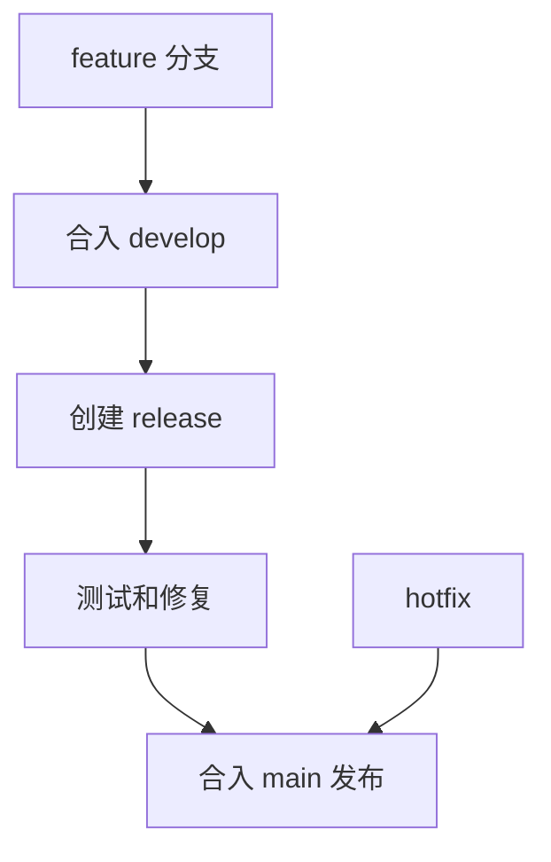

# Git Flow
Git Flow 是以 develop、feature、release、hotfix 等长期分支组织开发和发布的分支模型。

## 分支结构

- main/master：生产发布历史。
- develop：日常集成分支。
- feature：功能开发分支。
- release：发布准备和修复分支。
- hotfix：生产紧急修复分支。

## 工作流程

## 实践检查清单

- 团队是否真的需要长期 develop 和 release 分支。
- 发布周期是否较长且需要独立稳定分支。
- hotfix 是否能同时回合 main 和 develop。
- CI 是否覆盖各类分支。
- 是否和 [[Trunk Based]] 做过取舍比较。

## 案例

传统客户端或嵌入式项目发布周期长，可能适合 Git Flow；高频 Web 服务若有完善 CI 和 Feature Flag，通常更适合 Trunk Based。

## 常见误区

- 小团队照搬 Git Flow，分支管理成本超过收益。
- hotfix 合回遗漏，导致修复在后续版本丢失。

## 相关概念
- [[分支管理]]
- [[Trunk Based]]
