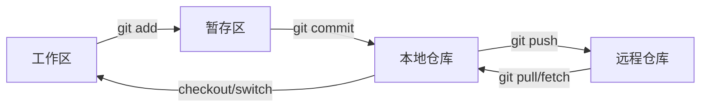

# Git 基础

## 定义

Git 是分布式版本控制系统，用提交记录文件变化，用分支隔离工作，用远程仓库协作同步。掌握 Git 基础的目标不是背命令，而是理解“工作区、暂存区、本地仓库、远程仓库”之间的数据流。

## 核心模型



## 常用命令

- `git status`：查看工作区和暂存区状态。
- `git add <file>`：把改动加入暂存区。
- `git commit -m "message"`：把暂存区保存为提交。
- `git log --oneline --graph`：查看提交历史。
- `git diff`：查看未暂存改动。
- `git diff --staged`：查看已暂存改动。
- `git branch`：查看分支。
- `git switch <branch>`：切换分支。
- `git fetch`：只拉取远程信息，不改工作区。
- `git pull`：拉取并合并或变基远程改动。

## 典型流程

1. `git status` 确认当前分支和未提交改动。
2. 修改文件并用 `git diff` 自查。
3. `git add` 只暂存本次任务相关文件。
4. `git diff --staged` 确认提交内容。
5. `git commit` 写清楚变更意图。
6. `git push` 推送到远程分支。

## 案例

修复一个接口超时配置：

```bash
git switch -c feature-timeout-config
git status
git diff
git add config/app.yml src/HttpClient.ts
git diff --staged
git commit -m "fix: tune http timeout config"
git push origin feature-timeout-config
```

## 常见误区

- 不看 `git status` 就切分支或提交。
- 一次提交混入格式化、重构和业务改动，导致 Review 困难。
- 用 `git add .` 暂存了无关文件。
- 把 `git pull` 当成无风险操作，忽略它可能触发合并冲突。

## 相关概念
- [[分支管理]]
- [[合并策略]]
- [[Rebase]]
- [[冲突解决]]
- [[PR 规范]]
