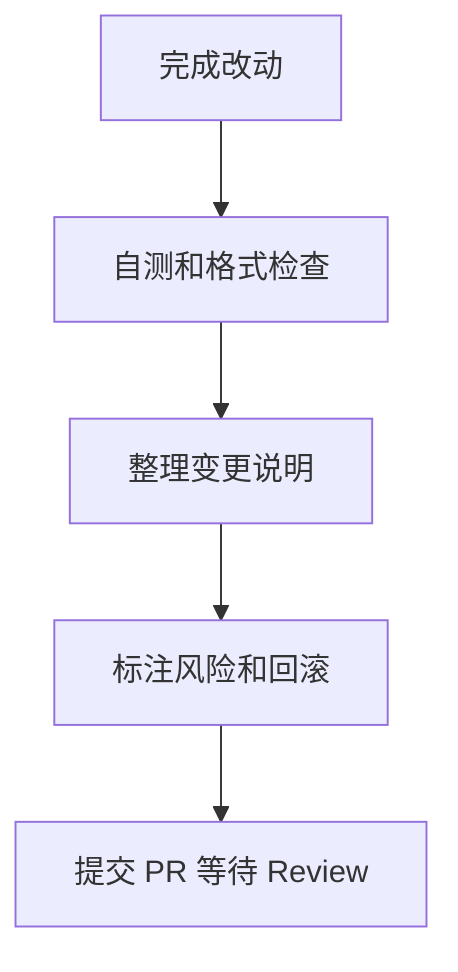

# PR 规范
PR 规范定义变更说明、测试证据、风险提示和审查要求，帮助团队稳定合并代码。

## PR 内容结构

- 背景：为什么需要这次改动。
- 变更：改了哪些模块和行为。
- 验证：跑了哪些测试或手动检查。
- 风险：可能影响哪些路径。
- 截图/日志：涉及 UI 或关键输出时附证据。

## 提交流程

## 检查清单

- 标题是否说明用户可见变化或技术目标。
- 描述是否能让审查者快速理解上下文。
- 测试证据是否覆盖主要改动。
- 是否标注破坏性变更、迁移步骤和配置变化。
- 是否避免把无关重构混进同一个 PR。

## 案例

修复登录 401 循环的 PR 应说明触发条件、刷新 token 锁、失败跳转策略、验证步骤和潜在影响，而不只是写“fix login bug”。

## 常见误区

- PR 过大，审查者无法聚焦风险。
- 描述只写“做了什么”，没有写“为什么做”。
- 没有测试证据，审查者只能凭感觉判断。
- UI 改动没有截图，接口改动没有示例响应。

## 复盘提示

好的 PR 应让审查者在几分钟内知道上下文、重点文件、验证方式和最大风险。描述越清楚，Review 越容易聚焦真实问题。

## 质量标准

PR 不是提交记录的重复，而是面向审查者的变更说明。合格 PR 应能回答：为什么改、改了什么、怎么验证、影响哪里、失败如何回滚。

## 审查友好性

小 PR、清晰标题、聚焦变更和完整验证证据，会显著降低审查成本。若 PR 必须很大，应在描述中拆出模块、风险和建议审查顺序。

## 相关概念
- [[Code Review]]
- [[冲突解决]]
