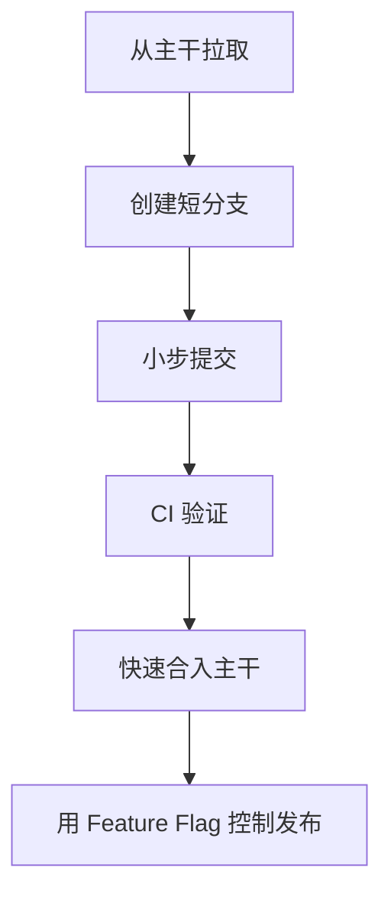

# Trunk Based
Trunk Based 是以主干为中心、短生命周期分支和高频集成的开发模式。

## 工作流程

## 适用场景

- 团队希望减少长期分支冲突。
- CI 自动化成熟，能快速验证主干质量。
- 功能可以通过 Feature Flag 或配置灰度。
- 变更能拆成小批量持续合入。

## 检查清单

- 分支生命周期是否足够短。
- 主干是否始终可构建、可测试、可发布。
- 大功能是否有 Feature Flag 隔离。
- CI 是否能阻止破坏主干的提交。
- 团队是否有小步提交和快速 Review 习惯。

## 案例

开发新支付入口时，可以先合入隐藏的路由和后端开关，再逐步接入 UI、风控和埋点。功能未完成前保持关闭，避免长分支积累大量冲突。

## 常见误区

- 分支虽然从主干切出，但长期不合并，实际变成长期分支。
- 没有 Feature Flag，却把半成品直接暴露给用户。
- CI 不稳定，导致团队不信任主干状态。
- 大批量改动一次合入，破坏小步集成的优势。

## 复盘提示

Trunk Based 的关键不是“不建分支”，而是“分支短、集成快、主干稳”。如果主干经常不可用，应该先补 CI 和回滚能力。

## 团队前提

这种模式依赖自动化测试、快速 Review、小步拆分和 Feature Flag。缺少这些基础设施时，强行推行 Trunk Based 可能只是把风险更快带入主干。

## 相关概念
- [[Git 基础]]
- [[Feature Flag]]
