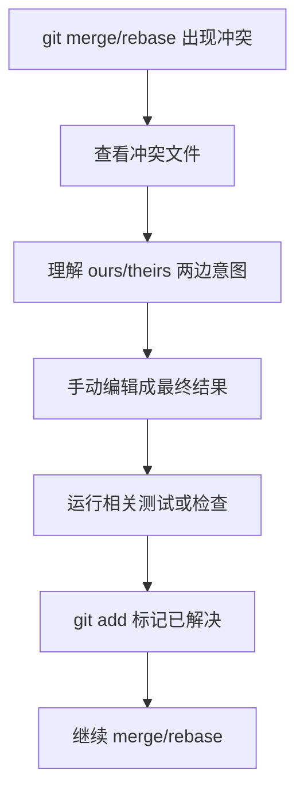

# 冲突解决

## 定义

冲突解决是在 Git 合并、变基或 cherry-pick 时处理同一位置不同改动的过程。它的目标不是机械删除冲突标记，而是理解两边改动意图，合并成一个仍然正确的结果。

## 基本流程



## 冲突标记

```text
\<<<<<<< HEAD
当前分支的内容
\=======
被合入分支的内容
\>>>>>>> feature
```

解决冲突时要删除这些标记，并保留正确合并后的代码或文本。

## 案例

两个人同时修改同一段接口说明：一边新增错误码，一边调整响应字段。正确处理通常不是二选一，而是同时保留错误码和新字段，并确认契约仍然一致。

## 检查清单

- 是否理解双方改动来源，而不是只保留自己的版本。
- 是否删除了所有冲突标记。
- 是否运行了受影响模块的测试、格式化或链接检查。
- 解决后是否检查 `git diff`，确认没有误删内容。
- rebase 冲突时是否用 `git rebase --continue` 继续流程。

## 常见误区

- 不理解代码意图，直接选择 ours 或 theirs。
- 只解决文本冲突，没有检查语义冲突，例如接口字段和调用方不匹配。
- rebase 中途混用 merge 命令，导致历史更难理解。
- 忘记运行测试，冲突标记虽然删除了，但功能已经损坏。

## 相关概念
- [[合并策略]]
- [[Rebase]]
- [[Code Review]]
