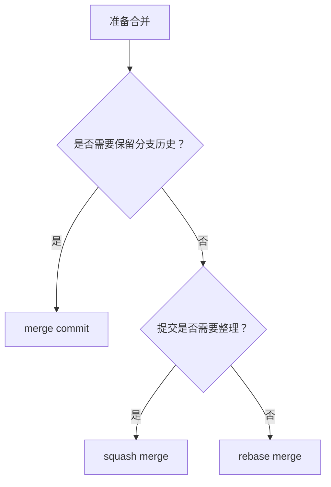

# 合并策略
合并策略决定分支改动如何进入主线，常见方式包括 merge commit、squash merge、rebase merge。

## 策略对比

| 策略 | 特点 | 适用场景 |
|------|------|----------|
| merge commit | 保留完整分支历史 | 需要追踪分支上下文 |
| squash merge | 多个提交压成一个 | PR 提交较碎、希望主线整洁 |
| rebase merge | 线性历史 | 团队重视干净提交线 |

## 选择流程

## 检查清单

- 团队是否统一合并策略。
- 是否需要保留每个原始提交。
- PR 是否包含多个无意义 WIP 提交。
- 合并前 CI 是否通过。
- 冲突解决是否只影响相关文件。

## 案例

小型功能 PR 通常适合 squash merge，让主线保持一条清晰提交；长期分支或复杂协作分支则可能需要 merge commit 保留上下文。

## 常见误区

- 团队没有统一策略，导致主线历史风格混乱。
- squash 后丢失重要提交信息，却没有在 PR 描述中补上下文。
- rebase 公共分支，影响其他协作者历史。
- 只追求线性历史，忽视排查问题时需要的合并上下文。

## 复盘提示

合并策略服务于团队协作和排障。主线历史应该让人能理解“何时、为什么、合入了什么”，而不是单纯追求看起来整齐。

## 相关概念
- [[Rebase]]
- [[冲突解决]]
