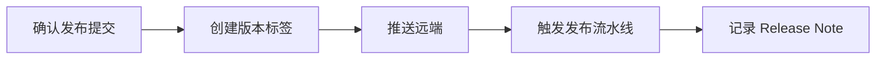

# 标签管理
标签管理用于给重要提交打版本标记，常用于发布版本和里程碑。

## 相关概念
- [[Git 基础]]
- [[CI-CD 流水线]]

## 使用流程

## 实践检查清单

- 标签是否打在已经验证通过的提交上。
- 标签命名是否统一，例如 `v1.2.3`。
- 是否使用带说明的 annotated tag，记录版本信息和发布人。
- 标签推送后是否触发正确的 CI/CD 发布流程。
- 需要回滚时是否能从标签快速定位对应镜像、包和提交。

## 案例

后端服务发布 `v2.4.0` 时，先确认主分支对应提交已通过测试，再打标签并推送。流水线基于标签构建镜像，Release Note 记录新增接口、兼容性变化和迁移步骤。

## 发布边界

标签的价值在于让“源码提交、构建产物、部署版本、发布说明”能够互相追溯。正式发布标签应尽量不可变，避免团队成员、CI 流水线和线上镜像引用同一个标签却指向不同提交。需要修复时应创建新标签，而不是重写旧标签。

语义化版本可以帮助判断影响范围：补丁版本修 bug，小版本加兼容能力，大版本包含破坏性变化。标签管理若和 Release Note、镜像 tag、包版本一致，回滚和审计会简单很多。

发布后应把标签、构建编号、部署环境和变更说明关联起来。这样线上出现问题时，可以快速确认哪个版本引入了风险。

测试标签、预发布标签和正式标签最好有固定命名规则，避免流水线误把临时版本当正式版本发布。

## 常见误区

- 在未验证提交上打标签，导致标签语义不可信。
- 删除或重写已发布标签，破坏团队和流水线对版本的引用。
- 标签命名混乱，无法区分测试版本、预发布版本和正式版本。
