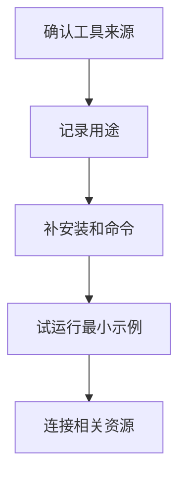

# GoClaw.sh
GoClaw.sh 是工具或脚本资源入口，当前作为知识图谱占位，后续可补充安装、用途和使用方式。

## 补充方向

GoClaw.sh 目前是资源占位，后续需要确认它的来源、目标用户、安装方式、核心命令和与同系列工具的关系。资源笔记应避免只保留名字，否则图谱连接没有实际含义。

## 整理流程

## 实践检查清单

- 是否有可信来源链接。
- 是否说明工具解决的具体问题。
- 是否记录适用平台和依赖。
- 是否有一个可复制的最小命令示例。
- 是否说明和 [[UI-UX-Pro-Max-Skill]]、[[AI工具对比]] 的关系。

## 案例模板

补全时可以写：适合谁、解决什么、如何安装、如何运行、输出什么、失败如何排查。若无法验证，应标注为待确认资源。

## 待验证字段

- 来源：项目主页、仓库、作者说明或安装脚本来源。
- 安装方式：是否通过 curl、npm、pip、brew 或二进制文件安装。
- 核心命令：最小可运行命令、输入参数和输出结果。
- 安全边界：是否会访问密钥、浏览器、文件系统或远程服务。
- 替代方案：和现有工具相比节省了什么步骤，增加了什么风险。

脚本类工具要优先确认可读源码和可回滚行为。若只能复制一段远程安装命令，但无法确认脚本内容，应放在资源线索中等待验证。

补全后可以把试用记录写成一段“最小验证”：在哪个目录执行、用了什么命令、生成了什么文件、如何清理。这样资源笔记才具备复用价值。

## 常见误区

- 把工具名当成知识点，不记录上下文。
- 没有验证就把脚本用于重要环境。

## 相关概念
- [[UI-UX-Pro-Max-Skill]]
- [[AI工具对比]]
