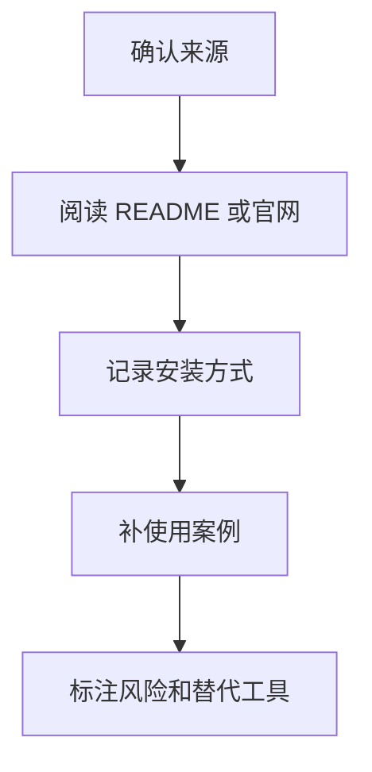

# TOSE.sh
TOSE.sh 是工具或脚本资源入口，当前作为知识图谱占位，后续可补充安装、用途和使用方式。

## 补充方向

这个资源类笔记后续应补齐来源、用途、安装方式、核心命令、适用场景和风险边界。若只是占位，会在知识图谱中形成弱节点，无法支撑实际查阅。

## 整理流程

## 实践检查清单

- 是否有官网、仓库或文档链接。
- 是否说明它解决什么问题。
- 是否记录安装、更新和卸载方式。
- 是否有最小可运行示例。
- 是否说明和 [[AI工具对比]] 中其他工具的关系。

## 案例模板

可以按“用途、安装、常用命令、输入输出、适合场景、不适合场景、相关工具”补全。若无法确认来源，应保留为资源线索而不是正式推荐。

## 常见误区

- 只保存工具名，不保存可验证来源。
- 没有试用记录就把工具列为推荐。

## 相关概念
- [[UI-UX-Pro-Max-Skill]]
- [[AI工具对比]]
