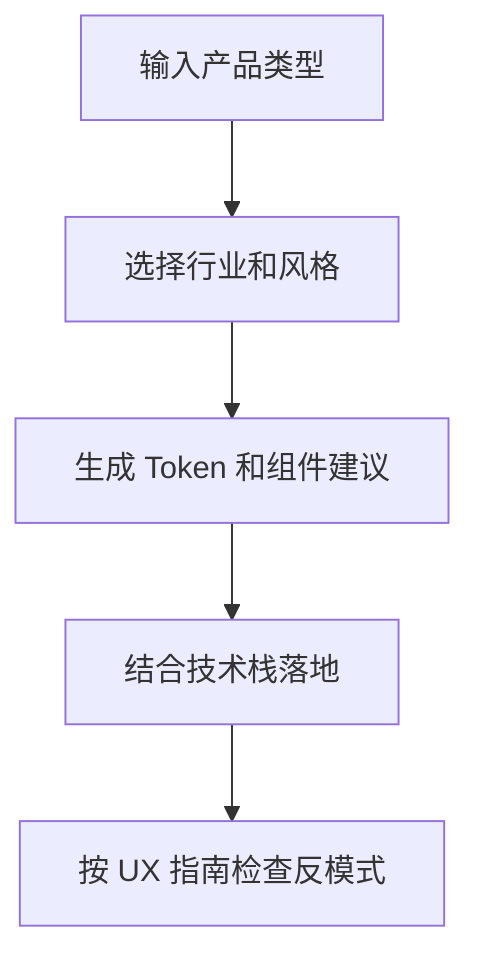

# UI UX Pro Max Skill

## 简介

UI UX Pro Max 是一个 AI 驱动的设计智能工具包，为多个平台和框架提供专业 UI/UX 设计指导。它可以作为 Claude Code、Cursor、Windsurf 等 AI 编码助手的技能/工作流使用。

**核心价值**：让 AI 自动生成符合行业最佳实践的设计系统，无需手动查阅设计规范。

---

## 有什么用

### 1. 智能设计系统生成
输入产品描述，AI 自动生成完整的设计系统：
- 页面结构模式（Pattern）
- UI 风格推荐（Style）
- 配色方案（Colors）
- 字体搭配（Typography）
- 动效建议（Effects）
- 反模式警示（Anti-patterns）

### 2. 161 个行业专用设计规则
覆盖以下领域：
| 类别 | 示例 |
|------|------|
| 科技/SaaS | SaaS、B2B服务、开发者工具、AI平台 |
| 金融 | 金融科技、银行、保险、记账工具 |
| 医疗健康 | 诊所、药店、心理健康、健身 |
| 电商 | 综合电商、奢侈品、P2P市场、订阅盒 |
| 服务 | 美容/SPA、餐厅、酒店、法律、家政 |
| 创意 | 作品集、摄影、游戏、音乐、视频编辑 |
| 生活方式 | 习惯追踪、食谱、冥想、天气、日记 |
| 新兴技术 | Web3/NFT、空间计算、无人机 |

### 3. 67 种 UI 风格库
包含 Glassmorphism、Claymorphism、Minimalism、Brutalism、Neumorphism、Bento Grid、Dark Mode、AI-Native UI 等流行风格。

### 4. 161 种行业配色方案
每种产品类型都有专门的配色方案，符合 WCAG AA 无障碍标准。

### 5. 57 种字体搭配
提供 Google Fonts 导入链接、Tailwind 配置、CSS 导入代码。

### 6. 15 种技术栈支持
React、Next.js、Astro、Vue、Nuxt.js、Svelte、SwiftUI、React Native、Flutter、HTML+Tailwind、shadcn/ui、Jetpack Compose、Angular、Laravel。

---

## 怎么用上

### 方式一：CLI 安装（推荐）

```bash
# 安装 CLI
npm install -g uipro-cli

# 进入项目目录
cd /path/to/your/project

# 为特定 AI 助手安装
uipro init --ai claude      # Claude Code
uipro init --ai cursor      # Cursor
uipro init --ai windsurf    # Windsurf
uipro init --ai copilot     # GitHub Copilot
uipro init --ai all         # 所有助手

# 全局安装（所有项目可用）
uipro init --ai claude --global
```

### 方式二：Claude Marketplace

```
/plugin marketplace add nextlevelbuilder/ui-ux-pro-max-skill
/plugin install ui-ux-pro-max@ui-ux-pro-max-skill
```

### 方式三：直接使用脚本

```bash
# 生成设计系统
python3 .claude/skills/ui-ux-pro-max/scripts/search.py "美容 SPA 养生" --design-system -p "Serenity Spa"

# Markdown 格式输出
python3 .claude/skills/ui-ux-pro-max/scripts/search.py "金融科技银行" --design-system -f markdown

# 特定领域搜索
python3 .claude/skills/ui-ux-pro-max/scripts/search.py "glassmorphism" --domain style
python3 .claude/skills/ui-ux-pro-max/scripts/search.py "优雅衬线" --domain typography
```

---

## 使用示例

### 自然语言触发（自动激活）

安装后，直接描述你的需求：

```
为我的 SaaS 产品构建一个落地页

创建一个医疗数据分析仪表板

设计一个深色模式的作品集网站

为电商设计一个移动端 UI

用深色主题构建一个金融科技银行应用
```

AI 会自动：
1. 分析产品类型
2. 生成设计系统
3. 推荐最佳风格/配色/字体
4. 生成代码实现
5. 检查反模式

### 工作流模式（斜杠命令）

某些平台支持斜杠命令：

```
/ui-ux-pro-max 为我的 SaaS 产品构建一个落地页
```

---

## 设计系统生成流程

```
┌─────────────────────────────────────────────────────┐
│  1. 用户请求                                          │
│     "为我的美容 SPA 构建落地页"                         │
└─────────────────────────────────────────────────────┘
                          │
                          ▼
┌─────────────────────────────────────────────────────┐
│  2. 多领域并行搜索（5 个维度）                          │
│     • 产品类型匹配（161 类别）                          │
│     • 风格推荐（67 种）                                │
│     • 配色选择（161 套）                               │
│     • 落地页模式（24 种）                              │
│     • 字体搭配（57 种）                                │
└─────────────────────────────────────────────────────┘
                          │
                          ▼
┌─────────────────────────────────────────────────────┐
│  3. 推理引擎                                          │
│     • 匹配产品 → UI 类别规则                           │
│     • 应用风格优先级（BM25 排序）                      │
│     • 过滤行业反模式                                   │
│     • 处理决策规则                                     │
└─────────────────────────────────────────────────────┘
                          │
                          ▼
┌─────────────────────────────────────────────────────┐
│  4. 完整设计系统输出                                    │
│     模式 + 风格 + 配色 + 字体 + 动效 + 反模式 + 检查清单  │
└─────────────────────────────────────────────────────┘
```

---

## 输出示例

```
+------------------------------------------------------------------------+
|  目标：Serenity Spa - 推荐设计系统                                       |
+------------------------------------------------------------------------+
|                                                                        |
|  模式：Hero 中心 + 社交证明                                               |
|     转化：情感驱动 + 信任元素                                             |
|     CTA：首屏上方， testimonials 后重复                                  |
|                                                                        |
|  风格：Soft UI Evolution                                                |
|     关键词：柔和阴影、微妙深度、平静、高端感、有机形状                       |
|     适用：健康、美容、生活方式品牌、高端服务                               |
|                                                                        |
|  配色：                                                                 |
|     主色：#E8B4B8（柔粉）                                                |
|     辅色：#A8D5BA（鼠尾草绿）                                             |
|     CTA：#D4AF37（金色）                                                 |
|     背景：#FFF5F5（暖白）                                                |
|     文字：#2D3436（炭灰）                                                |
|                                                                        |
|  字体：Cormorant Garamond / Montserrat                                  |
|     氛围：优雅、平静、精致                                                |
|                                                                        |
|  关键效果：柔和阴影 + 平滑过渡（200-300ms）+ 温和悬停状态                  |
|                                                                        |
|  避免（反模式）：                                                         |
|     明亮霓虹色 + 刺眼动画 + 深色模式 + AI 紫/粉渐变                        |
|                                                                        |
|  交付前检查清单：                                                         │
|     [ ] 不使用 emoji 作为图标（使用 SVG：Heroicons/Lucide）              │
|     [ ] 所有可点击元素有 cursor-pointer                                  │
|     [ ] 悬停状态有平滑过渡（150-300ms）                                   │
|     [ ] 浅色模式：文字对比度至少 4.5:1                                    │
|     [ ] 键盘导航的焦点状态可见                                            │
|     [ ] 尊重 prefers-reduced-motion                                      │
|     [ ] 响应式：375px、768px、1024px、1440px                             │
|                                                                        |
+------------------------------------------------------------------------+
```

---

## 核心数据表

| 数据文件 | 内容 | 数量 |
|---------|------|------|
| `products.csv` | 产品类型与推荐 | 161 |
| `styles.csv` | UI 风格定义与 CSS | 67 |
| `colors.csv` | 行业配色方案 | 161 |
| `typography.csv` | 字体搭配与导入代码 | 57 |
| `charts.csv` | 图表类型与库推荐 | 25 |
| `ux-guidelines.csv` | UX 最佳实践与反模式 | 99 |
| `ui-reasoning.csv` | 行业专用设计推理规则 | 161 |
| `landing.csv` | 落地页结构模式 | 24 |
| `icons.csv` | 图标库推荐 | - |
| `stacks/*.csv` | 各技术栈专用指南 | 15 |

---

## 相关资源

- **官网**：https://uupm.cc
- **GitHub**：https://github.com/nextlevelbuilder/ui-ux-pro-max-skill
- **CLI npm**：https://www.npmjs.com/package/uipro-cli
- **同系列工具**：
  - [[GoClaw.sh]] - Shell 脚本开发
  - [[ClaudeKit.cc]] - Claude 工具集
  - [[TOSE.sh]] - 终端工具

---

## 使用建议

1. **新项目启动**：用自然语言描述产品，让 AI 自动生成完整设计系统
2. **设计评审**：参考 UX 指南检查现有设计的反模式
3. **技术栈切换**：查询目标技术栈的最佳实践
4. **配色灵感**：浏览 161 种行业配色获取灵感
5. **字体搭配**：直接复制 Google Fonts 导入代码和 Tailwind 配置

## 使用流程



## 实践检查清单

- 是否先明确产品场景、用户和任务密度。
- 生成的配色、字体和组件是否符合品牌与可访问性。
- 是否结合现有设计系统，而不是直接覆盖。
- 是否检查移动端、表单、空状态和错误状态。
- 输出是否能转化为真实代码或设计规范。

## 使用流程


## 实践检查清单

- 是否先明确产品场景、用户和任务密度。
- 生成的配色、字体和组件是否符合品牌与可访问性。
- 是否结合现有设计系统，而不是直接覆盖。
- 是否检查移动端、表单、空状态和错误状态。
- 输出是否能转化为真实代码或设计规范。
