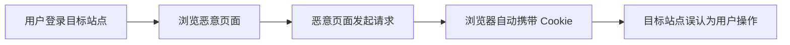

# CSRF
CSRF 是跨站请求伪造，利用用户已登录状态发起非预期请求。

## 相关概念
- [[CSRF 攻击与防护]]
- [[前端安全总览：XSS、CSRF 与 CSP]]

## 攻击流程

## 防护检查清单

- 状态变更请求是否使用 CSRF Token 或双提交 Cookie。
- Cookie 是否设置合适的 `SameSite`。
- 关键操作是否要求二次确认或重新认证。
- 服务端是否校验 Origin 或 Referer 作为辅助信号。
- GET 请求是否避免执行写操作。

## 案例

用户登录后台后访问恶意网页，网页自动提交“修改邮箱”的表单。如果后台只依赖 Cookie 登录态且没有 CSRF Token，浏览器会自动携带 Cookie，导致操作被执行。

## 常见误区

- 认为只要使用 POST 就不会被 CSRF。
- 只在前端加确认弹窗，服务端没有校验。
- 混淆 CSRF 和 XSS，忽略二者防护重点不同。
