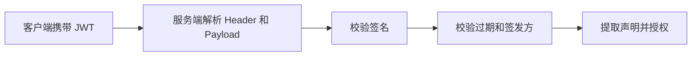

# JWT
JWT 是自包含 Token 格式，常用于无状态认证和声明传递。

## 相关概念
- [[JWT 登录认证完整流程]]
- [[前端鉴权与 Token 存储安全]]

## 校验流程

## 实践检查清单

- 是否校验签名算法，避免接受 `none` 或错误算法。
- 是否校验 `exp`、`iss`、`aud`、`nbf` 等关键声明。
- Token 中是否只放必要声明，不放密码、手机号等敏感信息。
- 是否设计刷新 Token、吊销和密钥轮换策略。
- 前端存储是否评估 XSS 和 CSRF 风险。

## 案例

移动端登录后拿到短期 Access Token 和长期 Refresh Token。接口只接受 Access Token；过期后使用 Refresh Token 换新。账号禁用或登出时，需要让 Refresh Token 失效，否则用户仍可持续换取新凭证。

## 常见误区

- 认为 JWT 无状态就不需要任何服务端失效机制。
- 把权限列表长期写进 Token，权限变更无法即时生效。
- 只解码 Payload，不校验签名。
