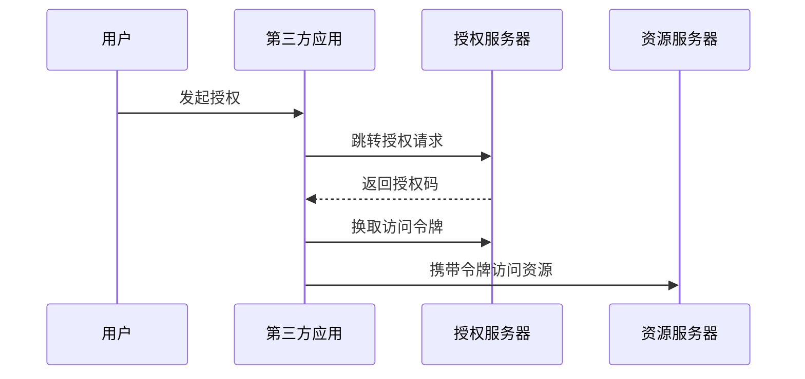

# OAuth
OAuth 是授权框架，允许第三方应用在用户授权后访问受保护资源。

## 相关概念
- [[OAuth2 与 OIDC 核心概念]]
- [[认证授权总览：Session、JWT、OAuth2 与 OIDC]]

## 授权流程

## 实践检查清单

- 是否优先使用授权码模式并配合 PKCE。
- 回调地址是否严格白名单校验。
- scope 是否最小化，不申请无关权限。
- Access Token 和 Refresh Token 是否有不同生命周期。
- 客户端密钥是否只保存在可信服务端。

## 案例

第三方日历应用请求读取用户日程时，应只申请日程只读 scope。用户授权后，应用使用访问令牌调用日历 API，而不是拿到用户账号密码。

## 常见误区

- 把 OAuth 当登录协议，忽略身份层需要 OIDC。
- 回调地址允许任意跳转，造成授权码泄露。
- scope 过大，用户授权一次后第三方拥有过多权限。
