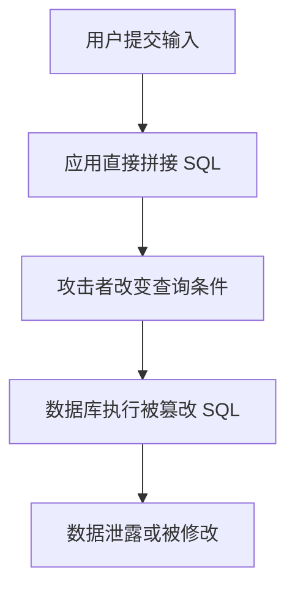

# SQL 注入
SQL 注入是把不可信输入拼入 SQL 导致查询语义被篡改的攻击方式。

## 攻击流程

## 防护方式

- 使用参数化查询或预编译语句。
- ORM 查询也要避免拼接原始 SQL。
- 输入验证用于限制格式和范围，但不能替代参数化。
- 数据库账号遵循最小权限。
- 错误信息不要暴露 SQL 细节。

## 实践检查清单

- 是否所有外部输入都通过参数绑定进入 SQL。
- 动态排序、字段名、表名是否使用白名单。
- 管理后台和内部接口是否同样防护。
- 数据库账号是否只拥有必要权限。
- 日志是否能追踪可疑查询但不泄露敏感值。

## 案例

登录接口如果把用户名直接拼成 `WHERE name = '${name}'`，攻击者可输入特殊字符串改变条件。正确做法是使用 `WHERE name = ?` 并把用户名作为参数传入。

## 常见误区

- 以为前端校验能阻止 SQL 注入。
- 只保护公开接口，忽视后台和脚本入口。
- 动态拼接 `ORDER BY` 字段时没有白名单。

## 相关概念
- [[输入验证]]
- [[API 安全基础]]
