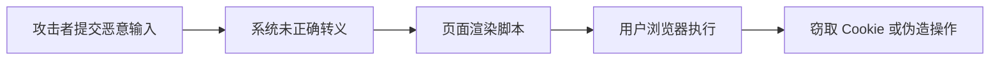

# XSS
XSS 是跨站脚本攻击，攻击者让恶意脚本在用户浏览器中执行。

## 相关概念
- [[XSS 攻击与防护]]
- [[CSP 内容安全策略]]

## 攻击流程

## 防护检查清单

- 用户输入输出到 HTML、属性、URL、JS 上下文时是否按上下文转义。
- 富文本是否使用可信白名单清洗，而不是简单替换字符串。
- 是否避免使用 `innerHTML` 渲染不可信内容。
- Cookie 是否设置 `HttpOnly`、`Secure`、`SameSite`。
- 是否配置 CSP 降低脚本注入后的影响范围。

## 案例

评论区把用户输入直接拼进 HTML，攻击者提交 `<script>` 读取用户信息。正确做法是存储原始文本或安全富文本，展示时按上下文转义，并限制可执行脚本来源。

## 常见误区

- 只在前端过滤输入，后端和其他客户端仍可绕过。
- 用黑名单拦截关键词，无法覆盖各种编码和上下文变形。
- 认为 React 等框架默认安全，就可以放心使用危险 HTML API。
