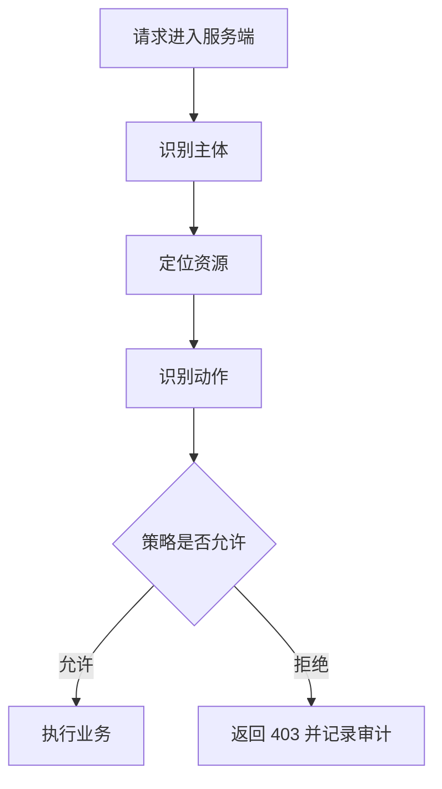

# 权限控制
权限控制决定主体是否可以对资源执行某个动作，必须由服务端强制执行。

## 相关概念
- [[RBAC 权限模型设计]]
- [[API 安全基础]]

## 判定流程

## 实践检查清单

- 是否区分认证、授权和数据范围。
- 权限校验是否在服务端执行，前端隐藏按钮只是体验优化。
- 是否校验资源归属，例如用户只能修改自己的订单。
- 管理员权限是否最小化，并保留审计日志。
- 权限变更是否能及时生效，避免旧 Token 长期携带过期权限。

## 案例

项目管理系统中，用户能否编辑任务不只取决于角色，还取决于该任务是否属于其所在项目、项目状态是否允许编辑、操作是否超过审批权限。

## 设计边界

权限控制通常包含三层：身份是谁，拥有什么角色或策略，对哪个资源执行什么动作。只做角色判断不够，很多越权问题来自资源归属缺失，例如用户拿到别人的订单 ID 后仍能访问详情。

权限系统要优先保证默认拒绝和最小权限。新增接口、后台入口和批量导出功能都应经过权限审查，不能默认复用旧接口的宽松规则。

排查权限问题时要同时看主体、资源、动作和数据范围。只看角色名很容易漏掉“能进入页面但不能操作某条数据”的细粒度约束。

## 常见误区

- 只校验菜单权限，不校验 API 和数据权限。
- 用前端路由守卫代替后端授权。
- 超级管理员过多，缺少审批和审计。

## 复盘问题

- 新增接口是否同时检查身份、资源归属、动作和数据范围。
- 权限变更是否能及时生效并留下审计记录。
