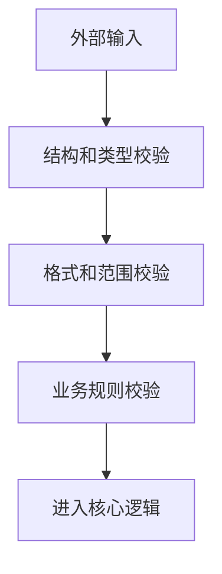

# 输入验证
输入验证是在系统边界检查类型、长度、格式、范围和业务状态，避免无效或恶意数据进入核心逻辑。

## 验证层次

- 类型验证：字段是否为字符串、数字、布尔、数组等。
- 格式验证：邮箱、手机号、日期、URL 是否符合格式。
- 范围验证：长度、数值区间、枚举值是否合法。
- 业务验证：状态是否允许变更、资源是否属于当前用户。
- 安全验证：是否包含危险 payload 或越权访问意图。

## 处理流程

## 实践检查清单

- 服务端是否始终做最终验证。
- 前端验证是否只作为体验优化。
- 是否对长度、枚举和数值范围设上限。
- 错误信息是否明确但不泄露敏感实现。
- 是否区分验证失败、认证失败和授权失败。

## 案例

创建订单接口不仅要验证商品 ID 和数量类型，还要验证商品是否存在、库存是否足够、用户是否有购买资格，以及价格是否以服务端计算为准。

## 分层责任

输入验证应放在所有系统边界：前端、API 网关、后端 Controller、业务服务和数据写入前都可能需要不同层次的校验。前端负责即时反馈，后端负责最终裁决；网关可做协议和体积限制，业务层负责状态和权限规则。

验证失败的响应也要设计好。用户可修正的错误应给出明确字段提示；疑似攻击或越权请求则应减少细节，避免暴露内部规则。验证日志要能帮助定位问题，但不能记录密码、Token、身份证等敏感值。

## 常见误区

- 只依赖前端表单校验。
- 把输入验证等同于安全防护，忽视授权和业务状态。
- 错误信息暴露数据库字段或内部规则。

## 相关概念
- [[API 安全基础]]
- [[SQL 注入]]
