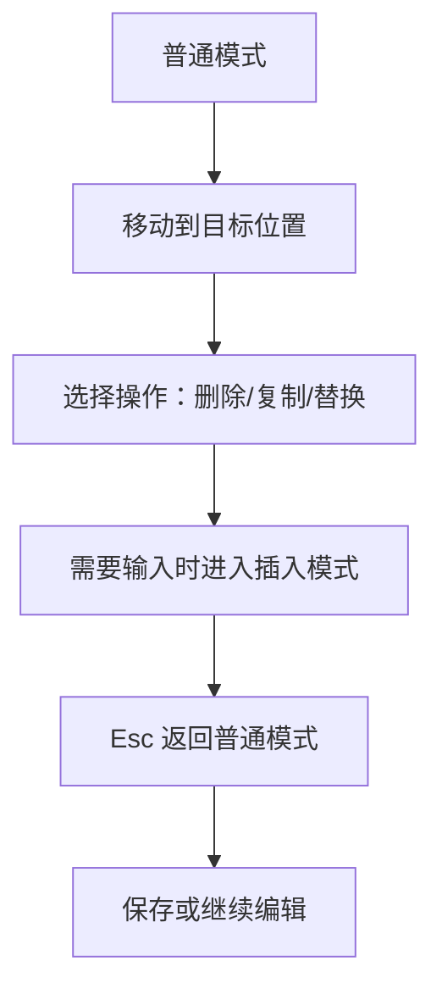

# Vim
Vim 是模式编辑器，强调普通模式、插入模式、命令组合和高效文本操作。

## 核心模式

- 普通模式：移动光标、删除、复制、粘贴和组合命令。
- 插入模式：输入文本。
- 可视模式：选择文本块后执行操作。
- 命令模式：保存、退出、查找替换和执行命令。

## 操作流程

## 实践检查清单

- 是否熟悉 `h/j/k/l`、`w/b`、`gg/G` 等移动方式。
- 是否能组合动词和范围，例如 `dw`、`ciw`、`d$`。
- 是否能用 `/` 查找，用 `:%s/a/b/g` 替换。
- 是否知道 `u` 撤销、`Ctrl+r` 重做。
- 是否能在终端里完成基本编辑和保存退出。

## 案例

修改配置文件时，可以用 `/port` 搜索端口字段，`ciw` 修改当前单词，`:wq` 保存退出。Vim 的效率来自“动作 + 对象”的组合，而不是记住大量孤立快捷键。

## 学习路径

学习 Vim 不需要一开始配置复杂插件。先掌握模式切换、移动、查找、替换、撤销和保存退出，再练习“动词 + 文本对象”的组合，例如 `ci"` 修改引号内文本、`dap` 删除一个段落。熟悉这些后，再根据真实工作补多窗口、宏、寄存器和插件。

Vim 的价值在于远程服务器、终端环境和快速编辑配置文件。即使日常使用 VS Code，也值得掌握基础 Vim 操作，避免在 SSH、容器或 Git 提交信息编辑器里卡住。

## 常见误区

- 进入 Vim 后不知道当前模式，导致输入和命令混乱。
- 只会方向键移动，没有利用单词、行首行尾和搜索跳转。
- 不会保存退出，误以为终端卡住。

## 相关概念
- [[终端工具]]
