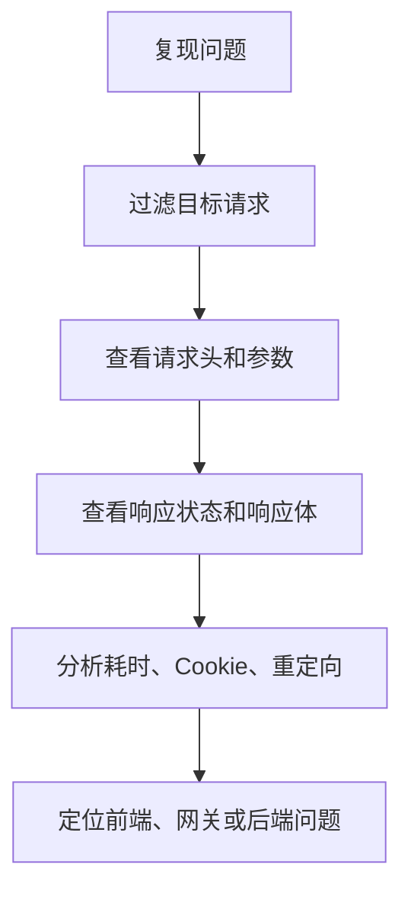

# 抓包分析
抓包分析通过观察请求、响应、Header、Cookie、TLS 和耗时定位网络与接口问题。

## 相关概念
- [[HTTP/HTTPS]]
- [[CORS]]

## 排查流程

## 实践检查清单

- 是否确认请求 URL、方法、状态码和响应体。
- 是否查看 Cookie、Authorization、CORS、缓存和重定向头。
- HTTPS 抓包是否只在授权设备和测试环境进行。
- 是否保存可复现证据，例如 HAR、curl 或截图。
- 是否脱敏后再分享抓包内容，避免泄露 Token 和用户数据。

## 案例

前端显示“无权限”，抓包发现接口返回 302 跳转登录页，而不是 403。继续检查请求发现 Cookie 没有随跨域请求发送，根因是客户端未开启 credentials 或服务端 SameSite 配置不匹配。

## 常见误区

- 只看控制台错误，不看真实网络请求和响应头。
- 把抓包结果原样发到群里，泄露认证信息。
- 没有过滤请求，淹没在大量静态资源和埋点流量中。
