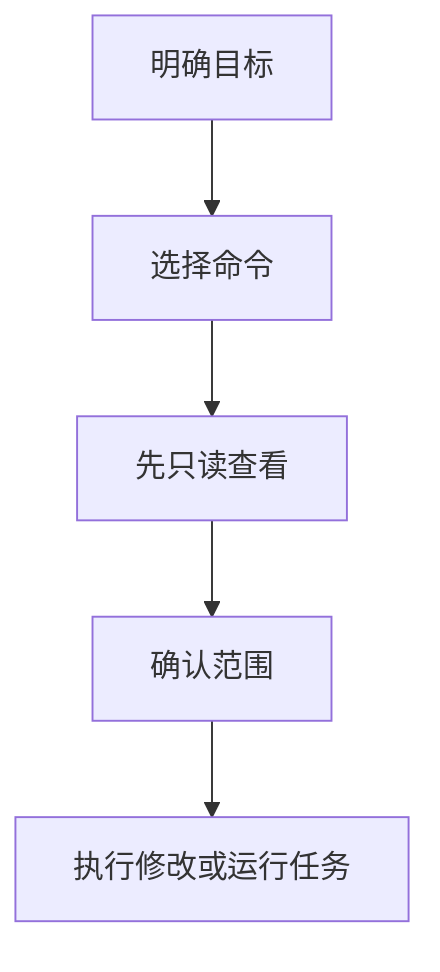

# 终端工具
终端工具包括 Shell、包管理器、Git、搜索工具、任务运行器和本地服务管理工具。

## 常见能力

- 文件与目录：`ls`、`cd`、`find`、`rg`。
- 文本处理：`cat`、`less`、`sed`、`awk`。
- 进程网络：`ps`、`lsof`、`curl`。
- 版本管理：`git status`、`git diff`、`git log`。
- 任务运行：npm scripts、Makefile、Docker Compose。

## 使用流程

## 检查清单

- 破坏性命令执行前是否确认路径和范围。
- 搜索代码是否优先使用 `rg`。
- 命令输出是否能保存或复现。
- 本地服务端口冲突时是否能定位进程。
- 是否理解 shell 通配符、管道和重定向。

## 案例

排查端口占用可以先用 `lsof -i :3000` 查看进程，再决定是否停止服务。不要直接批量 kill 进程，避免影响无关本地任务。

## 常见误区

- 不确认当前目录就执行删除或移动命令。
- 把管道、重定向和通配符混用，导致影响范围扩大。
- 只记命令，不理解输入、输出和退出码。
- 遇到权限问题直接加 sudo，而不看文件属主和路径。

## 复盘提示

终端能力的核心是可观察和可复现。重要命令执行前先用只读命令确认范围，执行后保留输出或日志，便于之后判断问题是否真的解决。

## 安全边界

涉及删除、覆盖、权限、远程执行和生产环境的命令，都应该先在最小范围验证。命令越短，越要确认它的工作目录和匹配对象。

## 相关概念
- [[Git 基础]]
- [[Vim]]
