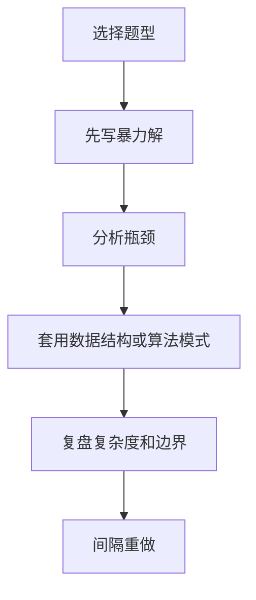

# LeetCode 计划
LeetCode 计划用于按数据结构、题型和复盘节奏组织刷题训练。

## 训练流程

## 题型分组

- 基础结构：数组、链表、栈、队列、哈希表。
- 搜索遍历：二分、DFS、BFS、回溯。
- 优化问题：贪心、动态规划、滑动窗口。
- 图与树：树遍历、拓扑排序、最短路。

## 检查清单

- 是否按题型训练，而不是随机刷题。
- 是否每题记录关键模式和反例。
- 是否能先说清楚暴力解。
- 是否写复杂度和空间代价。
- 是否安排 1 天、3 天、7 天间隔复习。

## 案例

做完“有效括号”后，应归入 [[栈与队列]]，记录“遇到配对和最近未匹配元素时考虑栈”。后续遇到路径回退、表达式解析，也可以复用同一模式。

## 常见误区

- 只追求刷题数量，不复盘题型。
- 看懂题解后就算完成，没有独立重写。
- 按难度随机刷，基础模式没有成体系。
- 不记录错因，导致一段时间后重复犯错。

## 复盘提示

计划中应该保留“重做队列”：凡是看题解才通过、边界条件错、复杂度不达标的题，都进入重做队列。重做通过比新增题量更能反映掌握程度。

## 质量标准

一个有效计划应能说明每周练什么题型、复盘哪些错题、哪些模式已经掌握、哪些模式还不稳定。没有复盘和重做的计划，本质上只是题目清单。

## 验收方式

阶段验收不看刷题总数，而看能否在限定时间内独立识别题型、写出可运行代码、说明复杂度，并在追问时解释为什么这样做。

## 相关概念
- [[面试题整理]]
- [[动态规划]]
